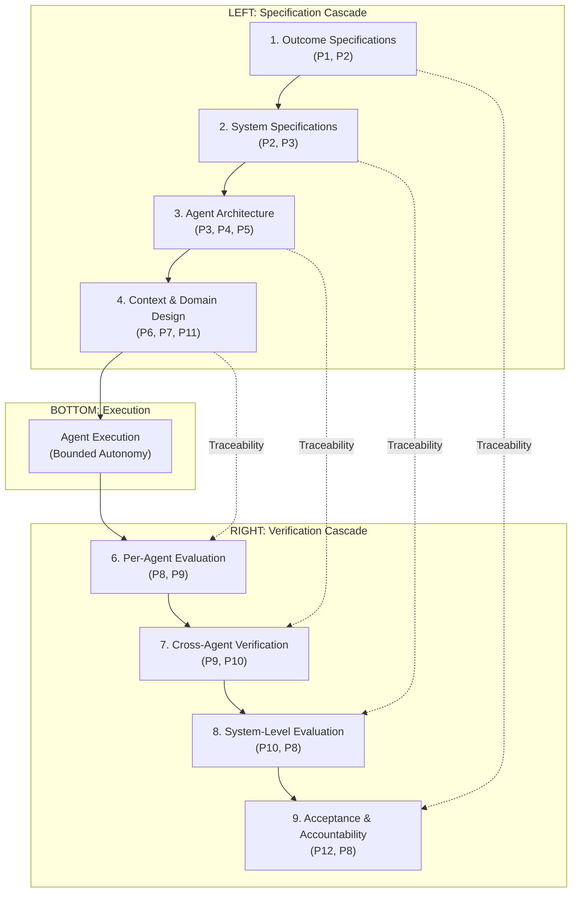

# Adoption Path — The Agentic V-Model

*For organizations transitioning from a traditional V-model SDLC to agentic
engineering. This is a V-model-specific variant of
[adoption-path.md](adoption-path.md).*

Read the [Manifesto](manifesto.md) for the core principles. Read the
[Companion Guide](companion-guide.md) for implementation depth. Read the
[Adoption Playbook](adoption-playbook.md) for organizational change management.

For generic (non-V-model) adoption steps, see [adoption-path.md](adoption-path.md).

---

## Core Thesis

The transition should **not** throw away the V-model.

In life sciences, aerospace, automotive, and regulated financial services, the
V-model survives because it solves real problems: it forces early definition of
intended use and design inputs, creates explicit traceability between
requirements and evidence, distinguishes verification from validation, and fits
quality systems, change control, and audit expectations.

What changes in an agentic SDLC is not the need for rigor. What changes is the
way rigor is expressed:

- specifications become more structured and machine-readable
- verification becomes more automated, layered, and continuously replayable
- validation remains human-owned, but is better instrumented
- traceability moves from manual spreadsheet labor to generated evidence graphs
- implementation shifts from direct human authorship to governed agent execution
  inside bounded harnesses

The right goal: **keep the V-model's assurance logic, but retool its artifacts,
gates, and execution model for agents.**

### What Should Stay the Same

- Intended use, risk classification, and release responsibility remain human
  accountabilities.
- Verification and validation remain distinct disciplines.
- Change control, approval records, and traceability remain mandatory.
- Higher-risk functions retain stricter review, narrower autonomy, and stronger
  evidence requirements.
- Validation against clinical, operational, or business reality cannot be
  delegated fully to an agent.

### What Should Change

- Requirements become versioned, structured, and reusable by both humans and
  agents.
- Architecture is encoded as enforceable constraints, not just diagrams and
  prose.
- Verification plans become executable evaluation suites.
- Evidence bundles are assembled automatically from traces, tests, policies,
  and artifacts.
- Agents assist with decomposition, implementation, regression analysis,
  traceability, and document assembly under explicit autonomy tiers.
- Post-release monitoring and periodic revalidation become part of the same
  lifecycle, not a separate operational afterthought.

---

## The Traditional V-Model

```
Stakeholder         <----------------->         Acceptance
Requirements                                  Testing
    \                                           /
  System            <----------------->       System
  Requirements                              Testing
      \                                       /
    Architecture    <----------------->     Integration
    Design                                Testing
        \                                   /
      Detailed      <----------------->   Unit
      Design                            Testing
          \                               /
            --->  Implementation  <---
```

Each left-side phase produces a specification. Each right-side phase verifies
that specification. The horizontal arrows are traceability links. The bottom
of the V is human implementation.

---

## The Agentic V-Model

```
Outcome             <----------------->        Acceptance &
Specifications                               Accountability
(P1, P2)                                     (P12, P8)
    \                                           /
  System            <----------------->       System-Level
  Specifications                            Evaluation
  (P2, P3)                                  (P10, P8)
      \                                       /
    Agent           <----------------->     Cross-Agent
    Architecture                          Verification
    (P3, P4, P5)                          (P9, P10)
        \                                   /
      Context &     <----------------->   Per-Agent
      Domain Design                     Evaluation
      (P6, P7, P11)                     (P8, P9)
          \                               /
            --->  Agent Execution  <---
                  (Bounded Autonomy)
```

The structural symmetry is preserved: every specification level maps to a
verification level. But every layer has changed in substance.

| Classical V-model stage | Agentic equivalent | What changes | Human accountability remains at |
|---|---|---|---|
| User needs / intended use | Structured intent package | Intended use, hazards, workflow assumptions, risk class, and success criteria become explicit machine-readable inputs | intended use, risk acceptance, go / no-go |
| System requirements | Versioned requirement contracts | Requirements include acceptance criteria, stop criteria, data constraints, and traceability IDs | requirement approval and scope decisions |
| High-level design | Enforced architectural policy | ADRs, bounded contexts, tool permissions, and data boundaries become executable constraints | boundary ownership and exception approval |
| Detailed design | Executable specifications | Interfaces, invariants, state models, and critical decision rules become machine-checkable | design review at risk-based depth |
| Implementation | Harnessed agent execution | Agents draft, implement, refactor, and document inside governed sandboxes | autonomy tier approval and exception handling |
| Unit / component verification | Deterministic verification-as-code | Tests, static analysis, contracts, replay, and proofs are run automatically | review of failures, waivers, and critical evidence |
| Integration verification | Tool, workflow, and protocol verification | Agents and tools are verified as a system, not component by component only | approval of integration evidence and unresolved deviations |
| System verification | Evaluation harnesses | End-to-end workflows, adversarial cases, reliability, and economics are evaluated continuously | decision on fitness for intended technical use |
| Validation | Human-led contextual validation | Workflow fit, clinical or user value, and real-world operating assumptions are assessed with stronger instrumentation | validation conclusion and release decision |
| Maintenance / changes | Continuous revalidation loop | Drift, regressions, memory updates, and agent policy changes re-enter change control | periodic revalidation and CAPA ownership |

---

## Layer-by-Layer Transformation

### Level 1: Stakeholder Requirements --> Outcome Specifications

**Traditional:** Business analysts translate stakeholder needs into a
requirements document. Requirements are written in natural language, reviewed
by humans, and baselined.

**Agentic:** Outcome specifications replace requirements documents.
Specifications are machine-readable: they define what "done" means in terms
agents can evaluate autonomously (Principle 1). They include acceptance
criteria, boundary conditions, blast-radius constraints, and validation
criteria — not just verification criteria.

Validation ("did we build the right thing?") becomes a first-class concern
because agents can satisfy every verification check and still produce the
wrong outcome.

**What changes in practice:**
- Requirements become executable specifications with machine-readable
  acceptance criteria
- Validation criteria are defined upfront alongside verification criteria
- Specifications are versioned artifacts that evolve through the Agentic Loop
- Traceability is automatic: the specification is the input to the agent, and
  the trace records the link between specification and execution

### Level 2: System Requirements --> System Specifications

**Traditional:** System engineers decompose stakeholder requirements into
system requirements. Each system requirement is testable and traceable.

**Agentic:** System specifications define domain boundaries, inter-domain
contracts, and the constraints that agents must respect (Principle 3:
defense-in-depth). Each domain has a clear owner, a defined autonomy tier,
and machine-enforceable boundaries.

The key shift: system specifications are infrastructure-level constraints
that the runtime enforces. An agent that violates a domain boundary is
blocked by the system, not caught in review.

**What changes in practice:**
- System requirements become enforceable domain boundaries and typed contracts
- Decomposition is driven by blast radius and autonomy tiers, not just
  functional decomposition
- Each domain specifies its evidence bundle requirements by phase

### Level 3: Architecture Design --> Agent Architecture

**Traditional:** Software architects define the system structure: components,
interfaces, data flows, deployment topology.

**Agentic:** Agent architecture defines the topology of the agentic system:
how many agents, what roles, what coordination pattern (Principle 4). It
defines the autonomy tier for each agent (Principle 5) and the
defense-in-depth layers that wrap probabilistic decisions in deterministic
infrastructure (Principle 3).

Architecture also encompasses context architecture (Principle 7) and memory
architecture (Principle 6).

**What changes in practice:**
- Component diagrams become agent topology diagrams with explicit authority
  relationships
- Data flow diagrams include context flow, memory flow, and cost flow
- Architecture decisions include model selection rationale, routing policies,
  and cost targets (Principle 11)

### Level 4: Detailed Design --> Context and Domain Design

**Traditional:** Module-level design defines the internal structure of each
component. This is the last specification level before coding begins.

**Agentic:** Context and domain design defines what each agent needs to
execute correctly: its context budget, retrieval configuration, memory access,
tool permissions, and evaluation criteria.

This layer is where most agentic projects fail. Teams jump from architecture
to execution without specifying what context each agent should see, what tools
it may use, what cost limits apply, or what evaluation criteria define success.

**What changes in practice:**
- Module designs become agent configuration specifications
- Algorithm selection becomes model selection with cost/quality tradeoffs
- Data structure design includes memory store design with the five governance
  properties (provenance, expiration, compression, rollback, domain scoping)
- Internal interfaces become tool contracts with typed inputs/outputs

### Level 5 (Bottom): Implementation --> Agent Execution

**Traditional:** Developers write code. The bottom of the V — the only layer
where artifacts are produced rather than specified or verified.

**Agentic:** Agents execute within bounded autonomy. They receive
specifications, context, and tool access. They produce code, artifacts,
decisions, or actions. They generate traces of their reasoning. They are
evaluated against criteria they may not see (evaluation holdout).

The fundamental shift: implementation is delegated. The human's role moves
from writing code to defining the conditions under which agents execute and
verifying the results.

**What changes in practice:**
- Coding sessions become agent execution sessions with full trace capture
- Code review becomes evidence bundle review (diff + tests + trace + rollback)
- The implementation artifact includes not just the code but the trace that
  explains how and why it was produced

### Level 6 (Right, ascending): Unit Testing --> Per-Agent Evaluation

**Traditional:** Unit tests verify that each module behaves as designed.

**Agentic:** Per-agent evaluation portfolios verify that each agent's output
meets its specification (Principle 8). This includes happy-path validation,
adversarial testing, regression coverage, and behavioral checks. Evaluation
holdout prevents agents from overfitting to visible criteria.

Structured traces (Principle 9) make every agent decision inspectable.

**What changes in practice:**
- Unit tests become evaluation portfolios with four coverage categories
- Test execution becomes continuous evaluation on every change
- Test reports become structured traces queryable by any dimension

### Level 7: Integration Testing --> Cross-Agent Verification

**Traditional:** Integration tests verify that subsystems work together.

**Agentic:** Cross-agent verification confirms that agents interacting across
domain boundaries produce correct system-level behavior. This includes trace
correlation across agent chains, drift detection, and cost anomaly monitoring.

This layer also includes the behavioral vs. structural regression distinction:
an agent's output may pass all current evaluations but degrade the codebase's
capacity for future change.

**What changes in practice:**
- Integration test suites become cross-domain evaluation portfolios
- Interface testing becomes trace correlation and provenance verification
- Structural regression monitoring is added alongside behavioral regression

### Level 8: System Testing --> System-Level Evaluation

**Traditional:** System tests verify the complete system against system
requirements including non-functional requirements.

**Agentic:** System-level evaluation includes chaos testing (Principle 10)
and threat modeling for agentic systems. This tests what happens when tools
fail, retrieval is noisy, memory is corrupted, or agents interact in
unexpected ways.

**What changes in practice:**
- System test plans become chaos testing plans with safety models
- Security testing becomes agentic threat modeling (prompt injection,
  memory poisoning, agent impersonation, data exfiltration)
- Non-functional testing includes total cost of correctness measurement

### Level 9 (Top right): Acceptance Testing --> Acceptance and Accountability

**Traditional:** Acceptance tests verify the system against stakeholder
requirements. In regulated industries, this includes formal sign-off by a
qualified person.

**Agentic:** Acceptance and accountability verification confirms that a named
human can inspect the reasoning, review the evidence, and own the outcome of
every production agent (Principle 12). This is tier-calibrated governance:

- **Tier 1 (Observe):** Human executes every action. Accountability is
  inherent.
- **Tier 2 (Branch):** Human owns constraint design and evaluation portfolio.
- **Tier 3 (Commit):** Human owns policy design, sampling strategy, incident
  response. Automated enforcement handles routine checks.

Evidence bundles are the acceptance artifact: diff, tests, trace, rollback
command, policy checks, and cost accounting — all phase-gated and immutable.

**What changes in practice:**
- UAT becomes evidence bundle review with tier-appropriate depth
- Formal sign-off becomes accountability assignment with trace-backed evidence
- Release gates become phase-calibrated evidence thresholds
- Post-release monitoring becomes continuous behavioral observability

---

## What the Agentic V-Model Adds

The agentic V-model is not simply "V-model with AI at the bottom." It adds
structural elements that the traditional V-model does not address:

**Continuous verification.** The traditional V-model verifies at gates. The
agentic V-model verifies continuously — evaluations run on every change, not
at phase transitions.

**Emergence testing.** The traditional V-model assumes deterministic
implementation. Agentic systems are probabilistic and exhibit emergent
behavior. Chaos testing and containment engineering have no equivalent in the
traditional V.

**Behavioral observability.** The traditional V-model verifies correctness
at each level. The agentic V-model also monitors for drift, anomaly, and
constraint violation in real-time between verification levels.

**Accountability under non-determinism.** When agents implement at scale,
comprehensive inspection is impossible. The agentic V-model replaces direct
inspection with tiered governance: humans own the constraints, evaluations,
and evidence model — not every individual output.

**Economic optimization.** The traditional V-model does not address the cost
of verification. The agentic V-model includes economics as a first-class
concern (Principle 11).

---

## ALCOA+ Traceability Through the Agentic V-Model

For GxP and regulated environments, the agentic V-model produces ALCOA+
compliant records at every layer by construction:

| V-Model Layer | Record Produced | ALCOA+ Properties Satisfied |
|---------------|----------------|----------------------------|
| Outcome Specifications | Versioned, machine-readable specs | Original, Legible, Enduring |
| System Specifications | Domain boundaries, autonomy tiers | Consistent, Complete |
| Agent Architecture | Topology decisions, routing policies | Attributable, Accurate |
| Context/Domain Design | Agent configurations, tool scopes | Complete, Consistent |
| Agent Execution | Structured traces with full reasoning | Contemporaneous, Attributable, Original |
| Per-Agent Evaluation | Evaluation results, evidence bundles | Accurate, Available |
| Cross-Agent Verification | Correlated traces, provenance | Complete, Attributable |
| System-Level Evaluation | Chaos test records, threat models | Enduring, Available |
| Acceptance & Accountability | Named owner sign-off, evidence | Attributable, Complete, Available |

The trace chain from outcome specification through agent execution to
acceptance evidence is unbroken, machine-queryable, and immutable.

---

## Transition Principles

### 1. Start with specification engineering, not coding agents

If requirements are vague, agents will merely produce ambiguity faster.
Specification quality is the primary upstream control variable.

### 2. Modernize verification before expanding autonomy

Autonomy without a strong right side of the V creates faster defect production,
not faster compliant delivery.

### 3. Keep validation explicitly human-led

Verification asks whether the system satisfies the specification. Validation
asks whether the specification was worth building. Agents can support
validation; they should not own it.

### 4. Treat architecture as policy

In a standard SDLC, architecture can be partly social. In an agentic SDLC,
domain boundaries, tool permissions, and data handling rules must be enforced
by the runtime.

### 5. Make traceability an output of the system

Do not scale manual trace matrices. Generate traceability from linked,
versioned artifacts, execution traces, tests, approvals, and evidence bundles.

### 6. Expand autonomy by risk tier, never uniformly

Low-risk artifacts can move to agent assistance early. High-risk requirements,
validation conclusions, and release approvals remain strongly human-governed.

---

## Transition Roadmap

This roadmap assumes a serious regulated environment and a staged transition.
The phases are sequential in emphasis, but some activities overlap.

| Phase | Focus | Typical duration | Primary outcome | Manifesto phase |
|---|---|---|---|---|
| 0 | Baseline and segmentation | 4-6 weeks | Current V-model mapped, risk classes segmented, pilot scope chosen | Pre-Phase 3 |
| 1 | Specification foundation | 6-10 weeks | Requirements become structured, versioned, and agent-usable | Phase 2-3 |
| 2 | Verification and validation backbone | 8-12 weeks | V and V evidence becomes executable, repeatable, and tiered | Phase 3 |
| 3 | Architecture and harness controls | 6-10 weeks | Agents operate inside enforceable boundaries | Phase 3-4 |
| 4 | Controlled agent-assisted build and test | 8-12 weeks | Agents contribute under supervision and evidence gates | Phase 3-4 |
| 5 | Integrated agentic V-model release loop | 8-12 weeks | Release, change control, and revalidation become evidence-driven | Phase 4-5 |
| 6 | Full agentic SDLC | ongoing | Governed autonomy across the lifecycle | Phase 5+ |

### Phase 0 — Baseline and Segmentation

**Objective:** Understand the current V-model implementation before changing it.

**Activities:**
- Map current lifecycle artifacts: intended use, requirements, architecture,
  verification plans, validation protocols, trace matrices, release records
- Segment products and workflows by risk and regulatory consequence
- Identify where traceability is manual, weak, or routinely backfilled
- Define autonomy red lines: high-risk approvals remain human-owned
- Select one pilot value stream

**Exit criteria:**
- The organization can name which lifecycle decisions will remain human-only
- The first pilot scope is explicit and bounded
- Current evidence gaps are known

### Phase 1 — Specification Foundation

**Objective:** Turn design inputs into structured artifacts that can steer
agents safely.

**Activities:**
- Standardize templates for intended use, user needs, system requirements,
  and detailed specifications
- Require every requirement to include: rationale, acceptance criteria,
  trace ID, risk tag, source, and owner
- Add stop criteria to major work items
- Define interface contracts and prohibited behaviors in machine-usable form
- Introduce specification review focused on ambiguity and unverifiable language

**Exit criteria:**
- A reviewer can determine whether a requirement is specific enough for an
  agent to act on
- Trace IDs are stable and versioned
- Ambiguous prose is being reduced before implementation starts

### Phase 2 — Verification and Validation Backbone

**Objective:** Rebuild the right side of the V as an executable evidence system.

**Activities:**
- Convert verification plans into executable suites: unit tests, integration
  tests, policy checks, static analysis, simulation, adversarial scenarios
- Define evidence bundles for each change: trace links, diffs, test outputs,
  review outcomes, policy checks
- Separate verification layers: deterministic, statistical, formal, human
- Define validation protocols that remain human-led but instrumented
- Establish failure handling: explicit deviations, root-cause tagging

**Exit criteria:**
- Verification evidence can be regenerated, not merely asserted
- Validation records distinguish technical correctness from contextual fitness
- Teams can show which requirements are insufficiently covered by evidence

### Phase 3 — Architecture and Harness Controls

**Objective:** Ensure agents execute inside bounded constraints.

**Activities:**
- Convert architecture rules into enforceable controls: domain ownership,
  dependency rules, tool permissions, data-access policies
- Define the agent harness: prompts, tool registry, runtime permissions,
  checkpointing, trace capture, evidence collection
- Create autonomy tiers by risk class
- Introduce sandboxing for agent execution

**Exit criteria:**
- Agents cannot bypass architectural rules through prompt interpretation alone
- Every agent action in the pilot is attributable and auditable

### Phase 4 — Controlled Agent-Assisted Build and Test

**Objective:** Use agents in implementation and verification without breaking
the quality system.

**Activities:**
- Start with bounded tasks: draft low-risk code, generate tests, propose
  trace links, summarize impact, prepare evidence packs
- Require every agent-produced change to pass the verification backbone
- Route higher-risk changes through narrower autonomy and deeper review
- Capture review outcomes as structured signals: accepted, rejected, partially
  accepted, policy exception, unclear spec
- Measure where agent output fails: bad decomposition, hallucinated
  requirements, architectural drift, weak evidence

**Exit criteria:**
- Agent assistance reduces cycle time on low-to-medium-risk work without
  reducing assurance quality
- Human reviewers focus on risk and ambiguity, not rereading every low-level
  step
- The pilot produces reusable evidence and lessons

### Phase 5 — Integrated Agentic V-Model Release Loop

**Objective:** Move from isolated pilot to a governed lifecycle that closes the
loop from requirement change to monitored release and revalidation.

**Activities:**
- Integrate generated traceability into change control and release records
- Add periodic revalidation triggers: model change, tool change, policy change,
  workflow change, observed drift
- Define how memory or learned agent behaviors are versioned and approved
- Connect field data, deviations, and CAPA findings back into requirement and
  validation updates
- Establish evidence-based release readiness

**Exit criteria:**
- A post-release issue can be traced to the relevant requirement,
  implementation, evidence, and approval path
- Revalidation triggers are explicit rather than ad hoc
- The lifecycle is closed from design input to operational learning

### Phase 6 — Full Agentic SDLC

**Characteristics:**
- Specifications are the primary work product
- Verification is largely automated and replayable
- Validation is instrumented and human-owned
- Traceability is generated continuously
- Architecture is enforced at runtime
- Agents operate under risk-tiered autonomy
- Deviations, incidents, and revalidation update the system continuously

**This is not:** unrestricted autonomous change in high-risk areas,
agent-written documentation without evidence linkage, replacing QMS discipline
with prompt craft, or treating validation as another test suite.

---

## Recommended Transition Sequence by Artifact

1. **Intended use and user needs** — Tighten purpose, scope, hazards,
   exclusions, and success criteria.
2. **System and software requirements** — Make them versioned, structured,
   and traceable.
3. **Verification plans** — Convert to executable evidence where possible.
4. **Validation plans** — Clarify human-led contextual validation and
   decision ownership.
5. **Architecture and design constraints** — Encode boundaries, permissions,
   and invariants.
6. **Implementation workflow** — Introduce harnessed agents on bounded work.
7. **Traceability and evidence management** — Generate, do not manually
   reconstruct.
8. **Release, change control, and revalidation** — Close the loop
   operationally.

That order is deliberate: **specification first, verification second,
architecture third, autonomy fourth.**

---

## Role Evolution in a V-Model Context

### Quality / Validation functions

Move from document checkers to evidence-system governors. Own validation
integrity, deviations, and release confidence boundaries.

### System / software architects

Move from describing design to encoding enforceable constraints and approved
execution zones.

### Developers and technical leads

Spend more time on specification quality, interface design, evaluation design,
and exception handling. Spend less time on first-draft boilerplate
implementation.

### Regulatory / quality leadership

Focus on where agent participation changes the assurance case: electronic
records, traceability, tool qualification, approval semantics, and
revalidation triggers.

### Engineering leadership

Fund the evidence backbone, not just coding tools. Prevent local optimization
where teams adopt agents without verification, traceability, or validation
discipline.

---

## Metrics for the Transition

Do not measure success with raw output volume. Track:

- lead time from approved specification to verified evidence bundle
- first-pass acceptance rate of agent-generated changes
- percentage of requirements with executable verification coverage
- percentage of changes with complete traceability
- deviation rate introduced by agent-assisted work vs. human-only work
- reviewer time spent on low-risk vs. high-risk changes
- revalidation effort per major change class
- total cost of correctness:
  inference + verification + governance overhead + incident remediation

---

## Failure Modes to Avoid

- Automating implementation before fixing requirement quality
- Treating validation as test automation
- Allowing agents to modify constraints that should be governance-controlled
- Keeping traceability manual while scaling change volume
- Granting identical autonomy to low-risk and high-risk work
- Letting model or tool changes bypass revalidation logic
- Measuring success by throughput while reviewer fatigue and deviation rates
  climb

---

## Bottom Line

The V-model does not disappear in agentic engineering. It becomes more
important.

But its artifacts can no longer remain passive documents. They must become
active controls:

- specifications that steer machines
- architectures that constrain machines
- verification that proves what happened
- validation that confirms the work still matters
- traceability that is generated by the system itself

Organizations that already operate a mature V-model are better positioned for
agentic engineering than organizations that skipped the V-model for agile.
They already have the specification discipline, the verification culture, and
the traceability infrastructure. What they need to add is: machine-readable
specifications, evaluation portfolios that handle non-determinism, continuous
observability, emergence containment, and tiered accountability.

The V-model does not become obsolete. It becomes the governance skeleton that
makes autonomous execution safe.

---

## Appendix: Mermaid Diagram


