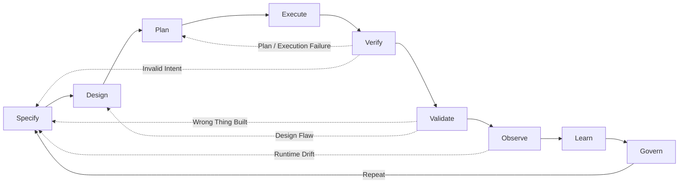

# The Agentic Engineering Manifesto

*Principles for building systems where humans steer intent, agents execute
within governed boundaries, and verified outcomes are the only measure that
matters.*

---

We are moving from writing software to architecting systems that write, test,
and ship software under human direction. Through this work, we have come to
value:

| We Value More | over | We Also Value |
|---|---|---|
| **Iterative steering and alignment** | over | Rigid upfront specifications |
| **Verified outcomes with auditable evidence** | over | Fluent assertions of success |
| **Right-sized agent collaboration** | over | Monolithic god-agents |
| **Curated, high-signal context and memory** | over | Stateless sessions and noisy memory |
| **Tooling, telemetry, and observability** | over | Chat-based heroics |
| **Resilience under stress** | over | Performance in ideal conditions |

That is, while there is value in the items on the right, we value the items on
the left more.

**Architectural basis (vendor-neutral):** enforceable constraints, durable
knowledge and memory, continuous evaluations, behavioral observability, and
economics-aware routing.

---

## What is Agentic Engineering?

Agentic Engineering is the discipline of architecting environments, constraints,
and feedback loops where autonomous agents can safely plan, execute, and verify
complex work under human governance.

It is distinct from:
- **AI Engineering**: Building and training the base models themselves.
- **Prompt Engineering**: Crafting text inputs to steer model outputs.
- **AI-Assisted Software Engineering**: Using AI as an autocomplete or co-pilot to
write human-authored code faster.

Agentic Engineering is about treating **agents as system components** rather
than as human proxies. It shifts the primary human role from writing code to
specifying intent, defining verifiable contracts, and operating the system that
executes the work.

---

## What This Is — and What It Is Not

This manifesto is not "prompting harder." It is not LLMs running production
unsupervised. It is not replacing engineering judgment with agent confidence,
and it is not more meetings with new names.

It is enforced constraints, verified outcomes, persistent learning, and human
accountability — applied to systems that include AI agents as first-class
participants in the engineering process.

---

## The Agentic Loop

Every principle in this manifesto serves a single feedback cycle:

**Specify → Design → Plan → Execute → Verify → Validate → Observe → Learn → Govern → Repeat**

This loop is not a waterfall. Any phase can trigger a return to an earlier one
based on evidence. The loop is the system. The principles are how you keep it honest.

- **Specify** defines what to build and why.
- **Design** architects how to build it: boundaries, topology, constraints.
- **Plan** decomposes the design into executable steps.
- **Execute** carries out the plan within bounded autonomy.
- **Verify** checks the output against the specification (did we build it right?).
- **Validate** checks the outcome against real-world need (did we build the right thing?).
- **Observe** monitors runtime behavior, drift, and cost.
- **Learn** updates knowledge, memory, and models from observations.
- **Govern** applies policy, accountability, and change control.

Verification and validation are distinct disciplines. Verification is
technical correctness against the spec. Validation is fitness for intended use
in the real world. An agent can pass every verification check and still fail
validation. Both are required.

Failures are data across every phase. Incidents, hallucinations, and policy
violations must produce post-incident updates to specifications, evaluations,
tooling constraints, and memory before retry.

---

## Twelve Principles

Minimum bars define baseline engineering discipline. Advanced bars indicate
recommended direction as autonomy, scale, and risk increase.

### 1. Outcomes are the unit of work

Progress is measured by the cycle **Outcome → Evidence → Learning** — not by
tokens generated, tasks dispatched, or agents spawned. An agent that says "done"
has proven nothing. A change is done only when it is shipped, observable,
verified against evaluations, and learned from. "It compiled" is not done. "The
agent said it worked" is not done. Done means: deployed, instrumented,
evaluated, and fed back into memory.

Evidence means: evaluation reports with pass/fail and metrics, trace IDs linking
to the full decision chain, diffs showing what changed, deployment IDs
confirming what shipped, rollback plans confirming reversibility, policy check
outputs confirming constraint compliance, and memory updates confirming what was
learned. Anything less is assertion, not evidence.

Agentic systems face a probability-compounding problem: if each module is
probabilistically correct with probability `p`, a system of `N` modules has
roughly `p^N` correctness. At scale, testing alone cannot offset this
multiplicative risk. This failure mode forces multi-agent swarms to build explicit
cross-verification between agents to break the compounding error chain.

This simplified model assumes independent failures. Real agentic systems often
have correlated failures that testing or proving alone cannot fix. A clearer
failure-domain decomposition is required:
- **Correlated model failure**: The same base model is used everywhere, making
reasoning blind spots systemic.
- **Correlated retrieval failure**: The same poisoned or stale knowledge base
shard feeds multiple agents.
- **Correlated tool failure**: The same flaky integration or API rate limit
blocks the entire swarm.
- **Correlated governance failure**: The same reviewer fatigue or policy
misconfiguration rubber-stamps errors.

These shared dependencies mean system-level risk is often much worse than `p^N`
suggests.

This does not mean full formal verification is a near-term default for every
team. It means assurance must scale with blast radius and system size.
Evidence bundles should be immutable, replayable, and auditable, with proof
artifacts introduced where risk justifies cost: signed trace manifests when
required by policy, deterministic replay artifacts, and formalized invariants
verified by proof or model-checking tools where warranted.

*Minimum bar: If it is not deployed, instrumented, and evaluated with attached
evidence, it is not done.*

### 2. Specifications are living artifacts that evolve through steering

Requirements, constraints, and acceptance criteria must be versioned,
reviewable, and machine-readable — because they drive agent behavior directly.
We do not prompt agents; we architect them. But specifications are not written
once and handed down. They are hypotheses that sharpen as agents explore the
problem space and evidence accumulates. A specification starts as intent and
constraints, then tightens through iterative refinement: specify, execute,
evaluate, adjust.

Vague intent produces vague results — but so does rigid intent that ignores what
agents discover during execution. Express what must be true when the work is
complete. Express what is forbidden. Let the swarm find the path. When the path
reveals that the spec was wrong, update the spec and run again.

In practice, this can include contract-first agentic development: agents propose
both implementation and machine-checkable contracts (preconditions,
postconditions, invariants), then iterate in a tight loop: specify, implement,
attempt to prove, fail, refine, repeat. Proof failure is not a blocker to hide;
it is a steering signal.

Specification evolution needs convergence criteria. Treat a specification as
converging when acceptance criteria remain stable across successive iterations,
scope narrows rather than expands, and incident classes trend downward. If each
loop adds ambiguity or expanding goals without quality improvement, treat it as
scope drift and reset the boundary.

*Minimum bar: If a specification cannot be versioned, reviewed, and revised
based on execution evidence, it is a wish, not an engineering artifact.*

### 3. Architecture is defense-in-depth, not a document

Domain boundaries define what agents may do and what they must not do.
Architecture Decision Records are not prose for humans to skim — they are rules
that constrain agent behavior. Encode boundaries as machine-enforced policies:
repository gates, type contracts, lint rules, domain ownership maps, CI checks.

But agents are probabilistic systems. Do not rely on an LLM's system prompt to
enforce your business rules. Prompts drift, and context windows degrade. They
approximate compliance — they do not guarantee it the way a compiler obeys
syntax. When architecture is merely described rather than enforced, agents will
violate it. When architecture is enforced but not monitored, violations will go
undetected.

Build deterministic infrastructure wrappers around your probabilistic AI. Enforce
permissions, repository gates, API rate limits, and data access at the system
level. If an agent tries to execute a destructive command, the infrastructure—not
the AI's internal logic—must block it. This contains your blast radius and
protects against prompt injection, hallucination loops, and poisoned memory banks.
Expect the boundary to be tested. Design for what happens when it is crossed.

Domain-Driven Design gives each swarm a bounded context — what it owns, where
code belongs, what is forbidden to reinvent. Retrieval is untrusted input; treat
context injection as a threat vector. This reduces swarm collisions and hardens
the system against both accidental drift and adversarial conditions.

*Minimum bar: If a boundary is described but not enforced at runtime with
automated detection and recovery, it is not architecture — it is documentation.*

### 4. Right-size the swarm to the task

Prefer specialized agents — planner, builder, tester, reviewer, security
auditor, operator — coordinated through shared contracts and state. But do not
default to maximum parallelism. A single well-evaluated agent with excellent
tools often outperforms an expensive, uncoordinated swarm. Scale agents to
complexity, not to ambition.

Parallelize exploration and analysis. Serialize decisions that change shared
state. Coordination is never free: shared state must be typed, versioned, and
reconciled. Contracts must be logged. Domain boundaries must prevent collisions.
Without these, a swarm is a mob — agents duplicating work, producing conflicting
diffs, or interpreting constraints inconsistently.

Design conflict resolution, not just parallelism. Swarms propose; a single
commit path commits. Choose the simplest topology that solves the problem —
single agent, pipeline, hierarchy, or mesh — and graduate to more complex
coordination only when evidence shows it is needed.

Topology choices must be explicit, for example:
- **Single agent/pipeline** for bounded tasks with low coordination overhead.
- **Hierarchy** for clear decomposition with centralized decision checkpoints.
- **Mesh** for discovery-heavy work where peers benefit from lateral coordination.
- **Bio-inspired swarms (experimental, e.g. bee-hive patterns)** for large
  search and exploration spaces where many short-lived workers can parallelize
  collection, triage, and handoff to specialist roles.

Default to single, pipeline, hierarchy, or mesh unless measured results justify
bio-inspired coordination for a specific workload.

Expected failure modes differ by topology: bottlenecked leads in hierarchies,
coordination storms in meshes, hidden coupling in pipelines, and role drift or
signal-amplification errors in bio-inspired swarms (for example, over-committing
to early weak signals). Use bio-inspired topologies only with empirical evidence
that they outperform simpler topologies for the target workload.

*Minimum bar: If shared state is not typed, versioned, and reconciled, the swarm
is a mob.*

### 5. Autonomy is a tiered budget, not a switch

Grant permissions by risk tier, least privilege, and blast-radius limits. Tools
are capabilities; audit tool access and grant least privilege. Make risky
actions reversible or approval-gated. Agents behave like serverless functions,
not employees: spin up for a guarded task, verify the result, and terminate.
Long-lived agents are an exception that requires explicit justification,
heartbeat monitoring, and drift controls.

Autonomy operates in explicit tiers:

**Tier 1 — Observe.** Agents analyze and propose. Changes are reviewed post-hoc.
Blast radius: none.

**Tier 2 — Branch.** Agents write to isolated branches. Humans approve merges.
Blast radius: contained.

**Tier 3 — Commit.** Agents take production-impacting actions with explicit
human approval, attached rollback plans, and verified evidence of constraint
compliance. Blast radius: governed.

The human role is to define the specification, set the tier, and own the outcome
— not to supervise every intermediate step. But autonomy without governance is
negligence. Calibrate the tier to the stakes.

*Minimum bar: If you cannot reconstruct an agent's reasoning at any tier, your
autonomy model has failed.*

### 6. Knowledge and memory are distinct infrastructure

An agent without memory is a liability. But knowledge and memory are not the
same thing, and conflating them is dangerous.

**Knowledge** is ground truth: code, documentation, Architecture Decision
Records, formal contracts and invariants, domain constraints. It is versioned,
deterministic, and authoritative. It changes through governed processes.

**Learned memory** is heuristic: reasoning patterns, incident learnings, routing
preferences, team-specific conventions. It is probabilistic, subject to decay,
and requires active curation. It changes through feedback loops.

Both are mandatory. But they are governed differently. Knowledge is persistent
and version-controlled. Learned memory must support provenance (where did this
come from?), expiration (when does this stop being valid?), compression (how do
we keep signal without drowning in noise?), rollback (how do we undo a poisoned
lesson?), and domain scoping (what context does this apply to?).

Memory can be poisoned. Every memory entry needs provenance and governance. An
agent that remembers too much hallucinates from noise. An agent that remembers
nothing repeats every mistake. If mistakes repeat, improve the loop:
specifications, evaluations, tools, or memory. Diagnosis precedes blame.

*Minimum bar: If memory cannot expire, be rolled back, or show provenance, it is
not memory — it is a liability.*

### 7. Context is engineered like code

If the knowledge store is polluted with bad embeddings or stale data, the agent
hallucinates — no matter how clean the code. Context quality and code quality
are coupled; neither survives without the other. Context is now a first-class
dependency, engineered with the same rigor as code: versioned, tested, and
performance-benchmarked.

Context retrieval must be fast enough to sustain the reasoning loop. If an agent
takes ten seconds to find context, the thought chain breaks. Invest in retrieval
performance the way you once invested in build performance. Strict latency bounds,
optimized indices, and tiered storage are not luxuries. They are what make the
reasoning loop viable.

Define tiered SLO guidance by architecture class (local, remote, hybrid+rerank,
regulated logging) for context and decisions. Establish practical retrieval and decision
latency baselines suitable for interactive engineering loops, with alerts and
rollback policies when breached.

Context windows are finite and reasoning quality degrades as low-signal context
accumulates. Engineer explicit context budgeting for long-running tasks:
hierarchical retrieval, rolling summaries, state compaction, and authority-
weighted pruning.

Codify "never do X here" as machine-enforced guidance: repository policies,
architectural constraints, ADR rules, lints, CI gates. Make the knowledge base
self-improving: let retrieval quality metrics feed back into indexing and
curation, so the system gets more precise over time rather than more cluttered.

*Minimum bar: If retrieval takes longer than the reasoning loop tolerates,
context is broken infrastructure.*

### 8. Evaluations are the contract; proofs are a scale strategy

Every change must preserve or improve evaluation performance. Evaluations are
not a quality gate at the end — they are the contract between human intent and
agent behavior. They define what "correct" means in terms the system can verify
autonomously.

As autonomy and module count grow, assurance must move across distinct practices
with different cost curves:
- **Evaluations and tests** for dynamic, example-based validation.
- **Formal contracts + proofs** for mathematically checking module properties.
- **Model checking** for state-space behavior (especially concurrency and
  protocol invariants).

These are not simple rungs with uniform effort. They are separate disciplines.
Use them intentionally: tests by default, formal methods first on critical paths
and high-blast-radius components, then expand coverage where incident data and
economics justify it.

Evaluations evolve with the system. They include happy-path validation,
adversarial testing, regression coverage, and behavioral checks. Without
evaluations, you are not iterating — you are guessing. An agent without
evaluations is a random walk with a language model.

When models judge model-generated outputs, evaluator and producer can share
blind spots. Mitigate LLM-as-judge risk with deterministic anchors, diverse
judge models, periodic human-calibrated gold sets, and disagreement tracking
between judges and production outcomes.

Beware evaluation theater: evals that pass but do not test what matters. If
evaluations do not cover edge cases, adversarial inputs, and behavioral
regressions, they are measuring comfort, not correctness. When evaluation
metrics become optimization targets rather than measures of quality, the system
games the metric and drifts from the goal.

*Minimum bar: If evaluations do not include regression cases, they are
insufficient. Advanced bar: include adversarial cases for externally exposed or
high-blast-radius systems. For model-judged evaluations, calibrate against
human-labeled samples on a defined cadence.*

### 9. Observability and interoperability cover reasoning, not just uptime

Instrument decisions, tool calls, policy violations, memory retrievals, cost per
task, and near-misses — so you can explain *why* something happened, not just
*that* it happened. Every agent action must produce an inspectable trace: diffs,
tool calls, decision chains, evaluation results, rollbacks.

Traces are not logging. Logging records events. Traces reconstruct reasoning —
the full chain from specification to decision to action to outcome. They are the
audit trail that makes agentic systems governable, debuggable, and safe.

If you cannot reconstruct what an agent did and why from traces alone, you
cannot operate safely at scale. If you cannot detect when an agent has deviated
from its constraints in near-real-time, your observability is incomplete.
Instrument the reasoning, not just the infrastructure.

*Minimum bar: If you cannot answer "why did this happen" from traces alone, you
are not instrumented.*

Interoperability is a prerequisite for observability at system boundaries.
Cross-runtime traces, policy audits, and deterministic replays only remain
trustworthy when tool contracts are standardized across vendors and runtimes.

Portable agentic systems depend on stable, vendor-neutral tool contracts.
Standardize tool and resource interfaces so agent runtimes, local automation,
and remote orchestration can interoperate without custom glue for each provider.

Interoperability requires typed schemas, explicit auth boundaries, versioned
capabilities, and replayable tool logs. Treat adapters as temporary bridges, not
architecture. The goal is replaceable components, not locked pipelines.

*Minimum bar: If tools cannot be swapped or replayed across runtimes without
rewriting core workflows, the platform is brittle.*

### 10. Assume emergence; engineer containment

Multi-agent systems exhibit emergent behavior by nature — some useful, some
dangerous. Expect nonlinear failures, feedback loops, and phase changes. Build
guardrails, rate limits, circuit breakers, and safe fallbacks before you need
them.

Practice chaos: test with tool outages, noisy retrieval, adversarial inputs,
partial memory corruption, reordered swarms, and model degradation — before
reality does. Offline tests are insufficient for systems that operate
autonomously in the wild. Enforce invariants at runtime with policy checks,
monitors, and automated intervention.

Threat modeling must explicitly include:
- prompt injection and jailbreak propagation across agent chains
- memory/context poisoning and supply-chain contamination
- agent impersonation and forged role assertions in swarm coordination
- data exfiltration through tool permissions and connector abuse

Defense-in-depth means identity for agents and tools, signed provenance for
shared state, least-privilege tool scopes, egress controls, and continuous
anomaly detection for cross-agent trust edges.

When emergence produces useful behavior, capture it — evaluate it, verify it,
and encode it in memory if it passes. When emergence produces dangerous
behavior, contain it — circuit-break, roll back, and learn from it. The
difference between these two outcomes is the quality of your containment
engineering.

*Minimum bar: If you have not tested with tool outages, noisy retrieval, and
adversarial inputs, you are not chaos-tested.*

### 11. Optimize the economics of intelligence

Agentic work is economics-aware. Not every task requires the most capable model.
The fastest way to burn your runway is to let complex swarms use premium models
for trivial tasks.

Build a dynamic routing layer. Route simple text transformations or basic logic
to fast, cheap models (e.g., Haiku or local small language models). Reserve
expensive, high-reasoning models (e.g., Opus or advanced reasoning tiers)
strictly for complex orchestration, final code reviews, and critical decision-making.

Model choice is a runtime decision, not a configuration constant. Intelligent
routing — selecting the right model, the right agent topology, and the right
resource tier for each task — extends effective capacity by multiples while
maintaining quality. This "economics-aware routing" must consider not just token
cost, but *correlation cost* (avoiding a single point of epistemic failure by
using diverse models and independent tool chains). Cost discipline is not a
constraint on capability — it is what makes sustained capability possible.

Inference cost and assurance cost are coupled, not independent knobs. Cheaper
models may require stronger verification, more retries, or tighter approvals.
Optimize total cost of correctness (`inference + verification + incident
remediation`), not inference cost alone.

Multi-model and multi-vendor swarms introduce heterogeneous failure and policy
risk. Model errors are often correlated through shared dependencies, similar
training artifacts, or vendor-side incidents. Routing policies must therefore
include failure-domain isolation, cross-model canary checks, and explicit data
handling boundaries per provider.

To mitigate systemic fragility, extend resilience measures across the stack:
- **Diversity routing** (different models/judges) to reduce correlated
  hallucinations.
- **Retrieval canaries** across independent indexes.
- **Tool redundancy plans** for rate limits/outages.

This is the "organism avoiding monoculture collapse."

Track cost per task, cost per outcome, and cost per quality unit. Make economic
tradeoffs visible and auditable. When the system learns which routing decisions
produce the best cost-quality outcomes, feed that learning back into the router.

*Minimum bar: If model choice is a configuration constant instead of a runtime
decision, you are overspending. Advanced bar: route by expected total cost of
correctness, not token price.*

### 12. Accountability requires visibility

Agents execute; humans own outcomes, risks, approvals, and incidents. No agent —
however capable — absorbs legal, ethical, or operational responsibility. Release
decisions, risk acceptance, production behavior, and incident response require a
human with skin in the game.

But accountability without visibility is a legal fiction. You cannot own what
you cannot see. The autonomy tiers in Principle 5, the traces in Principle 9,
and the evaluations in Principle 8 exist to make human accountability meaningful
rather than ceremonial.

At scale, ownership is domain-scoped, not change-scoped. A named human owns the
risk policy, approval thresholds, and incident response for a bounded domain;
the system enforces those policies per change. Human review must focus on
exceptions, high-risk deltas, and statistically valid sampling, not every low-
risk action.

The manifesto asks for human accountability at scale, which is mathematically
impossible if your agents are processing thousands of actions. For low-risk and
medium-risk tiers, remove the human from the loop. Instead, build recursive
feedback mechanisms where the system is forced to evaluate its own errors, feed
failures back into its context window, and self-correct or automatically roll
back.

If your engineers spend all day reviewing agent trace logs, you have simply
replaced coding with babysitting. True scale requires automated, isolated
sandboxes where failure is acceptable and recovery is instant.

When incidents occur, accountability is assigned by policy failure mode:
specification error, verification gap, enforcement failure, or operational
override. This avoids circular blame on the final approver and drives targeted
remediation. If trace volume exceeds meaningful human review, raise automation
barriers or reduce autonomy until oversight signal quality is restored.

This is mitigation, not full resolution. Oversight saturation at scale remains
an open problem: systems can outgrow meaningful human review bandwidth faster
than governance practices mature. Treat this as an active research and
operations frontier, not a solved control mechanism.

Failures are data: errors and crashes are learning opportunities, and
hallucinations can become a hallucination loop where plausible-but-wrong early
output drives increasingly wrong follow-on fixes. Never simply retry a failed
prompt. Diagnose, update memory, strengthen contracts and constraints, and rerun
verification before retrying. But someone must own the consequences when systems
go live. Clear responsibility is not bureaucracy; it is system safety.

*Minimum bar: If no named human can inspect the reasoning, review the evidence,
and own the outcome of a production agent, the system is ungoverned.*

---

## The Agentic Maturity Spectrum

Maturity is domain-specific, not organization-wide. A team can be Phase 5 in CI
and Phase 2 in production operations. Assess each domain honestly.

**Phase 1 — Guided Exploration ("vibe coding").** Single prompts, no structure,
no memory. Creative but unreliable. Useful for discovering what agents can do;
dangerous for anything that matters. *Failure mode: extrapolating demo results
to production expectations.*

**Phase 2 — Assisted Delivery.** AI as autocomplete. Copilot-style suggestions
where the human executes. Productivity gains are real but bounded by human
throughput. *Failure mode: optimizing human-in-the-loop speed instead of
questioning whether the loop is necessary.*

**Phase 3 — Agentic Prototyping.** Agents execute tasks autonomously within a
single session. Limited memory, limited verification. The moment most teams
realize prompting is not engineering. *Failure mode: autonomy without
verification — the agent said it worked.*

At this phase, teams should begin contract-aware prompting: agents produce
assertions and pre/postconditions with code, even before full proof pipelines
are in place.

**Phase 4 — Agentic Delivery.** Agents operate with basic guardrails:
autonomy tiers are defined, evaluations gate changes, and basic memory persists
across sessions. But the system is still single-domain, single-swarm, and
largely reactive. Teams have the discipline to verify outcomes and enforce
constraints, but specifications are still mostly human-authored and static.
Architecture is enforced but not yet defense-in-depth. *Failure mode: governance
without feedback — constraints are enforced but never updated by what the system
discovers.*

Phase 4 should pilot formal contracts on a narrow critical path only when team
capability and economics support it.

**Phase 5 — Agentic Engineering.** Structured autonomy at scale.
Specifications steer behavior and evolve through evidence. Multi-agent swarms
operate across domain boundaries, right-sized to each task. Memory is curated
infrastructure with provenance, expiration, and rollback. Evaluations include
adversarial and regression coverage. Observability covers reasoning chains, not
just uptime. Cost routing is deliberate. Architecture is defense-in-depth with
automated detection and recovery. The full Agentic Loop — Specify → Design → Plan →
Execute → Verify → Validate → Observe → Learn → Govern → Repeat — operates as a continuous
system. *Failure mode: evaluation theater — evals pass but do not test what
matters.*

This is where contract-first development becomes systematic: code, contracts,
and proofs co-evolve continuously rather than being bolted on late.

**Phase 6 — Adaptive Systems.** Self-improving infrastructure within governed
boundaries. Systems that build, test, and fix themselves — then learn from the
results. Continuous learning with active memory curation. Chaos-tested,
runtime-verified, economically optimized. Specifications co-evolve with the
system's understanding of the problem space. Phase 6 is not inevitable; it
requires capabilities — formal verification, causal reasoning, provable
containment — that are still maturing. Treat it as a frontier, not a
destination. *Failure mode: self-improvement without containment — optimizing
the metric, not the goal.*

At this phase, agents can propose contract refinements and invariant updates, but
proof systems and governance gates must validate changes before adoption.

The key transition is Phase 3 to Phase 5, with Phase 4 as the practical bridge.
Many teams can adopt governance and verification before they can operate a
continuous adaptive feedback loop. Teams that confuse guardrails with full
engineering discipline tend to plateau.

Exploration is a phase. Engineering is a discipline.

---

## The New Way of Working

**Humans** express intent as specifications with constraints and acceptance
criteria — then refine those specifications as evidence accumulates. They encode
architecture as enforceable, monitored domain boundaries. They set autonomy
tiers appropriate to risk. They own outcomes and remain accountable. They do not
supervise every intermediate step — they define what success looks like, verify
that the system achieved it, and inspect the reasoning when it matters.

**Agents** decompose specifications into executable tasks. They execute within
domain boundaries, right-sized to complexity. They verify their own outputs
against evaluations. They report evidence, not assertions. They learn from
failure and encode that learning in memory — with provenance, so the system
knows where every lesson came from.

**Systems** maintain persistent knowledge and curated learned memory. They route
work to appropriate model tiers based on cost and quality requirements. They
enforce architectural constraints at runtime and monitor for violations. They
observe behavior, surface anomalies, and maintain the feedback loops that make
everything else work. They forget what no longer serves them.

### How Roles Evolve

The transition from writing code to steering agents changes what each role owns
day-to-day.

**Developers** own specification quality, constraint encoding, and outcome
acceptance day to day. The core skill is expressing intent precisely enough that
agents can execute it, then refining intent based on evidence.

**Tech Leads** own domain boundaries, decision records, topology choices, and
conflict-resolution rules. The core skill is designing constraints that keep
multi-agent collaboration reliable under load.

**QA Engineers** own evaluation portfolios, adversarial coverage, formal-
invariant checks where needed, and evidence gates. The core skill is defining
the contract between intent and behavior in machine-verifiable terms.

**Operations Engineers** own behavioral observability, cost routing, memory
governance, runtime safety, and chaos drills. The core skill is keeping the
feedback loop honest under real-world conditions.

---

## The Agentic Definition of Done

Tokens generated and tasks dispatched are vanity metrics. "The agent said it
worked" is not a completed ticket.

A change is **done** when it is:

**Shipped** — deployed or delivered, not just merged.

**Observable** — instrumented and logged so reasoning can be inspected and
reconstructed from traces.

**Verified** — evaluated against regression tests (and adversarial cases),
with an evidence bundle (diffs, trace IDs, policy check outputs) required for
every automated merge.

**Provable (when risk requires it)** — formalized invariants and replayable
proof artifacts attached for critical workflows.

**Learned from** — knowledge base and learned memory updated with what was
discovered, with provenance.

**Governed** — operating within autonomy tiers appropriate to its risk, with
human accountability assigned.

**Economical** — routed through appropriate model tiers, cost tracked and
justified per outcome.

Anything less is in progress.

**Why it matters:** This forces the system to optimize for actual business
outcomes rather than raw output volume, killing the illusion of productivity.

---

## How to Read This Document

Use two layers:
- **Manifesto core**: values and twelve principles with minimum bars.
- **Companion guidance**: definitions, adoption path, examples, and change
  management for implementation.

---

## Boundary Conditions

This manifesto assumes the environment can support governed autonomy, reliable
evidence capture, and reversible operations. When these assumptions do not hold,
agentic engineering should be constrained or deferred.

Proceed cautiously or cap autonomy at Phase 2-3 when:
- certification or regulatory regimes require deterministic assurance patterns
  that the current agent/tool chain cannot meet
- safety-critical or real-time systems cannot tolerate probabilistic behavior at
  the current control boundary
- classified or restricted environments cannot satisfy data-handling and tool
  isolation requirements
- teams lack baseline CI/CD quality gates, incident response discipline, or
  domain ownership needed for safe autonomy

In these conditions, use agent assistance for analysis and drafting, but keep
critical implementation and release control predominantly human-driven until
constraints change.

---

## Operational Definitions

**Blast radius**: the maximum credible impact of a wrong action across users,
data, services, or regulatory obligations.

**Right-sized**: the smallest agent topology and model tier that can meet the
required quality and latency targets at acceptable total cost of correctness.

**Evidence bundle**: the minimum artifacts needed to justify a change at a given
phase and risk tier.

Phase-calibrated evidence examples:
- **Phase 3**: tests, diff, trace link, rollback note.
- **Phase 4**: Phase 3 bundle plus policy checks and incident tags.
- **Phase 5+**: Phase 4 bundle plus reproducible replay and, where justified,
  formal artifacts.

---

## Incremental Adoption Path

Start where you are. Do not attempt all principles at once.

1. Define domain boundaries and autonomy tiers.
2. Require evidence bundles for every merged change.
3. Add regression gates before expanding autonomy.
4. Add adversarial/security evaluations on exposed surfaces.
5. Pilot formal contracts on one high-blast-radius path.
6. Expand only when incident rate and economics improve.

---

## Worked Patterns

**Pattern A — Single-domain reliability fix**

Specification: "Retry payment capture exactly once after timeout; never
double-charge."

Agent decomposition: implement retry logic, add idempotency key handling, add
tests, produce trace and rollback plan.

Evidence bundle (Phase 4): diff, regression tests, trace ID, policy check
results, rollback command.

Outcome: shipped change, observed behavior, no duplicate charges in canary.

**Pattern B — Multi-agent, cross-domain coordination**

Specification: "Cancel order across `orders`, `billing`, and `notifications`
without double-refund, stale customer status, or orphaned events."

Swarm decomposition:
1. Planner agent creates domain tasks with shared invariants.
2. Domain agents implement bounded changes in parallel.
3. Verification agent runs cross-service regression and contract checks.
4. Coordinator agent resolves conflicting diffs through a single commit path.
5. Operations agent gates rollout with canary and rollback criteria.

Evidence bundle (Phase 5): per-domain diffs, cross-domain trace graph,
invariant check results, reconciliation decisions, canary metrics, rollback
commands.

Outcome: one conflicting refund rule detected pre-merge, corrected via
constraint update, release completed without refund duplication.

---

## Failure Pattern

Hallucination loop example: an agent misreads a timeout error as auth failure,
applies credential retries, and increases incident volume. The fix is not "retry
the prompt"; it is to add a contract/invariant ("timeout retry must not mutate
credentials"), update evals, and gate rollout until traces confirm behavior.

Operational recovery cycle:
1. Diagnose using traces and failure classification.
2. Add or tighten contract/invariant for the violated behavior.
3. Add regression and adversarial tests for the failure class.
4. Re-run verification and canary on constrained scope.
5. Promote only after evidence shows the loop is broken.

---

## Failure Modes of This Manifesto

Applied poorly, this manifesto can fail through:
- **Over-governance**: constraints so heavy that human coding becomes faster.
- **Evidence theater**: large bundles with low signal.
- **Control theater**: humans nominally accountable but operationally blind.
- **Security theater**: policies documented but not enforced at tool/runtime
  boundaries.

The corrective action is always the same: reduce ceremony, increase signal, and
measure cycle time, defect rate, and incident severity together.

---

## Organizational Change

Adoption requires explicit change management by phase:

**Phase 3 → 4 (governed delivery foundation)**
- add CI/CD evidence and policy gates
- assign domain owners and escalation rotations
- standardize incident classification and rollback drills

**Phase 4 → 5 (engineering-scale transition)**
- establish shared evaluation registry and trace standards
- create platform ownership for agent runtime, routing, and memory governance
- formalize security reviews for tools, connectors, and shared state

**Phase 5 → 6 (adaptive frontier)**
- require governance for self-updating specifications and routing policies
- maintain independent audit paths for high-impact domains
- treat formal methods expertise as targeted specialization, not universal role

Common change-program failure modes:
- process bloat that increases lead time without reducing incidents
- unclear ownership between platform, product, and operations teams
- autonomy expansion before evaluation quality is stable
- vendor lock-in through non-portable tool interfaces

---

## Test This Manifesto

Treat this manifesto as a living specification. Run pilots, publish failure
analyses, measure outcomes, and revise principles based on evidence from real
workflows.

Track these indicators each quarter:
- lead time from specification to verified deployment
- escaped defect rate and incident severity distribution
- rollback frequency and mean time to recovery
- policy violation rate and evidence bundle completeness
- human oversight load (high-risk reviews per domain owner)
- total cost of correctness by domain

If governance overhead rises while quality and resilience do not improve, reduce
control complexity and re-baseline autonomy scope.

---

*Exploration is a phase. Engineering is a discipline. These principles are not the last
word — they are the minimum for a world where systems build, test, and ship their own
code under human direction. The question that remains is whether governance can scale as
fast as autonomy. We bet it can. This manifesto is how we intend to prove it.*
