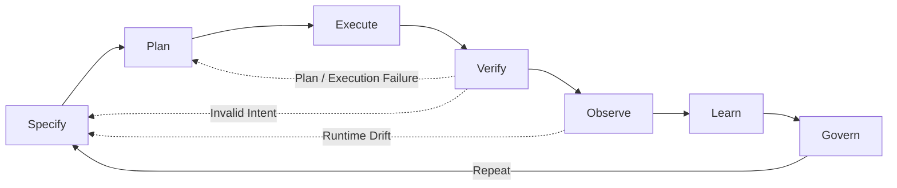

# The Agentic Engineering Manifesto

*Principles for building systems where humans steer intent, agents execute
within governed boundaries, and verified outcomes are the only measure that
matters.*

---

We are moving from writing software to architecting systems that write, test,
and ship software under human direction. Through this work, we have come to
value:

| We Value More | over | We Also Value |
|---|---|---|
| **Iterative steering and alignment** | over | Rigid upfront specifications |
| **Verified outcomes with auditable evidence** | over | Fluent assertions of success |
| **Right-sized agent collaboration** | over | Monolithic god-agents |
| **Curated, high-signal context and memory** | over | Stateless sessions and noisy memory |
| **Tooling, telemetry, and observability** | over | Chat-based heroics |
| **Resilience under stress** | over | Performance in ideal conditions |

That is, while there is value in the items on the right, we value the items on
the left more.

**Architectural basis (vendor-neutral):** enforceable constraints, durable
knowledge and memory, continuous evaluations, behavioral observability, and
economics-aware routing.

---

## What is Agentic Engineering?

Agentic Engineering is the discipline of architecting environments, constraints,
and feedback loops where autonomous agents can safely plan, execute, and verify
complex work under human governance.

It is distinct from:
- **AI Engineering**: Building and training the base models themselves.
- **Prompt Engineering**: Crafting text inputs to steer model outputs.
- **AI-Assisted Software Engineering**: Using AI as an autocomplete or co-pilot to
  write human-authored code faster.

Agentic Engineering is about treating **agents as system components** rather
than as human proxies. It shifts the primary human role from writing code to
specifying intent, defining verifiable contracts, and operating the system that
executes the work.

---

## What This Is — and What It Is Not

This manifesto is not "prompting harder." It is not LLMs running production
unsupervised. It is not replacing engineering judgment with agent confidence,
and it is not more meetings with new names.

It is enforced constraints, verified outcomes, persistent learning, and human
accountability — applied to systems that include AI agents as first-class
participants in the engineering process.

---

## The Agentic Loop

Every principle in this manifesto serves a single feedback cycle:

**Specify → Plan → Execute → Verify → Observe → Learn → Govern → Repeat**

This loop is not a waterfall. Any phase can trigger a return to an earlier one
based on evidence. The loop is the system. The principles are how you keep it honest.

Failures are data across every phase. Incidents, hallucinations, and policy
violations must produce post-incident updates to specifications, evaluations,
tooling constraints, and memory before retry.

---

## Twelve Principles

Minimum bars define baseline engineering discipline. Advanced bars indicate
recommended direction as autonomy, scale, and risk increase.

### 1. Outcomes are the unit of work

Progress is measured by the cycle **Outcome → Evidence → Learning** — not by
tokens generated, tasks dispatched, or agents spawned. An agent that says "done"
has proven nothing. A change is done only when it is shipped, observable,
verified against evaluations, and learned from. "It compiled" is not done. "The
agent said it worked" is not done. Done means: deployed, instrumented,
evaluated, and fed back into memory.

Evidence means: evaluation reports with pass/fail and metrics, trace IDs linking
to the full decision chain, diffs showing what changed, deployment IDs
confirming what shipped, rollback plans confirming reversibility, policy check
outputs confirming constraint compliance, and memory updates confirming what was
learned. Anything less is assertion, not evidence.

*Minimum bar: If it is not deployed, instrumented, and evaluated with attached
evidence, it is not done.*

### 2. Specifications are living artifacts that evolve through steering

Requirements, constraints, and acceptance criteria must be versioned,
reviewable, and machine-readable — because they drive agent behavior directly.
We do not prompt agents; we architect them. But specifications are not written
once and handed down. They are hypotheses that sharpen as agents explore the
problem space and evidence accumulates. A specification starts as intent and
constraints, then tightens through iterative refinement: specify, execute,
evaluate, adjust.

Vague intent produces vague results — but so does rigid intent that ignores what
agents discover during execution. Express what must be true when the work is
complete. Express what is forbidden. Let the swarm find the path. When the path
reveals that the spec was wrong, update the spec and run again.

*Minimum bar: If a specification cannot be versioned, reviewed, and revised
based on execution evidence, it is a wish, not an engineering artifact.*

### 3. Architecture is defense-in-depth, not a document

Domain boundaries define what agents may do and what they must not do.
Architecture Decision Records are not prose for humans to skim — they are rules
that constrain agent behavior. Encode boundaries as machine-enforced policies:
repository gates, type contracts, lint rules, domain ownership maps, CI checks.

But agents are probabilistic systems. Do not rely on an LLM's system prompt to
enforce your business rules. Prompts drift, and context windows degrade. They
approximate compliance — they do not guarantee it the way a compiler obeys
syntax. When architecture is merely described rather than enforced, agents will
violate it. When architecture is enforced but not monitored, violations will go
undetected.

Build deterministic infrastructure wrappers around your probabilistic AI. Enforce
permissions, repository gates, API rate limits, and data access at the system
level. If an agent tries to execute a destructive command, the infrastructure—not
the AI's internal logic—must block it. This contains your blast radius and
protects against prompt injection, hallucination loops, and poisoned memory banks.
Expect the boundary to be tested. Design for what happens when it is crossed.

*Minimum bar: If a boundary is described but not enforced at runtime with
automated detection and recovery, it is not architecture — it is documentation.*

### 4. Right-size the swarm to the task

Prefer specialized agents — planner, builder, tester, reviewer, security
auditor, operator — coordinated through shared contracts and state. But do not
default to maximum parallelism. A single well-evaluated agent with excellent
tools often outperforms an expensive, uncoordinated swarm. Scale agents to
complexity, not to ambition.

Parallelize exploration and analysis. Serialize decisions that change shared
state. Coordination is never free: shared state must be typed, versioned, and
reconciled. Contracts must be logged. Domain boundaries must prevent collisions.
Without these, a swarm is a mob — agents duplicating work, producing conflicting
diffs, or interpreting constraints inconsistently.

Design conflict resolution, not just parallelism. Swarms propose; a single
commit path commits. Choose the simplest topology that solves the problem —
single agent, pipeline, hierarchy, or mesh — and graduate to more complex
coordination only when evidence shows it is needed.

*Minimum bar: If shared state is not typed, versioned, and reconciled, the swarm
is a mob.*

### 5. Autonomy is a tiered budget, not a switch

Grant permissions by risk tier, least privilege, and blast-radius limits. Tools
are capabilities; audit tool access and grant least privilege. Make risky
actions reversible or approval-gated. Agents behave like serverless functions,
not employees: spin up for a guarded task, verify the result, and terminate.
Long-lived agents are an exception that requires explicit justification,
heartbeat monitoring, and drift controls.

Autonomy operates in explicit tiers:

**Tier 1 — Observe.** Agents analyze and propose. Changes are reviewed post-hoc.
Blast radius: none.

**Tier 2 — Branch.** Agents write to isolated branches. Humans approve merges.
Blast radius: contained.

**Tier 3 — Commit.** Agents take production-impacting actions with explicit
human approval, attached rollback plans, and verified evidence of constraint
compliance. Blast radius: governed.

The human role is to define the specification, set the tier, and own the outcome
— not to supervise every intermediate step. But autonomy without governance is
negligence. Calibrate the tier to the stakes.

*Minimum bar: If you cannot reconstruct an agent's reasoning at any tier, your
autonomy model has failed.*

### 6. Knowledge and memory are distinct infrastructure

An agent without memory is a liability. But knowledge and memory are not the
same thing, and conflating them is dangerous.

**Knowledge** is ground truth: code, documentation, Architecture Decision
Records, formal contracts and invariants, domain constraints. It is versioned,
deterministic, and authoritative. It changes through governed processes.

**Learned memory** is heuristic: reasoning patterns, incident learnings, routing
preferences, team-specific conventions. It is probabilistic, subject to decay,
and requires active curation. It changes through feedback loops.

Both are mandatory. But they are governed differently. Knowledge is persistent
and version-controlled. Learned memory must support provenance (where did this
come from?), expiration (when does this stop being valid?), compression (how do
we keep signal without drowning in noise?), rollback (how do we undo a poisoned
lesson?), and domain scoping (what context does this apply to?).

Memory can be poisoned. Every memory entry needs provenance and governance. An
agent that remembers too much hallucinates from noise. An agent that remembers
nothing repeats every mistake. If mistakes repeat, improve the loop:
specifications, evaluations, tools, or memory. Diagnosis precedes blame.

*Minimum bar: If memory cannot expire, be rolled back, or show provenance, it is
not memory — it is a liability.*

### 7. Context is engineered like code

If the knowledge store is polluted with bad embeddings or stale data, the agent
hallucinates — no matter how clean the code. Context quality and code quality
are coupled; neither survives without the other. Context is now a first-class
dependency, engineered with the same rigor as code: versioned, tested, and
performance-benchmarked.

Context retrieval must be fast enough to sustain the reasoning loop. If an agent
takes ten seconds to find context, the thought chain breaks. Invest in retrieval
performance the way you once invested in build performance. Strict latency bounds,
optimized indices, and tiered storage are not luxuries. They are what make the
reasoning loop viable.

*Minimum bar: If retrieval takes longer than the reasoning loop tolerates,
context is broken infrastructure.*

### 8. Evaluations are the contract; proofs are a scale strategy

Every change must preserve or improve evaluation performance. Evaluations are
not a quality gate at the end — they are the contract between human intent and
agent behavior. They define what "correct" means in terms the system can verify
autonomously.

Evaluations evolve with the system. They include happy-path validation,
adversarial testing, regression coverage, and behavioral checks. Without
evaluations, you are not iterating — you are guessing. An agent without
evaluations is a random walk with a language model.

*Minimum bar: If evaluations do not include regression cases, they are
insufficient. Advanced bar: include adversarial cases for externally exposed or
high-blast-radius systems. For model-judged evaluations, calibrate against
human-labeled samples on a defined cadence.*

### 9. Observability and interoperability cover reasoning, not just uptime

Instrument decisions, tool calls, policy violations, memory retrievals, cost per
task, and near-misses — so you can explain *why* something happened, not just
*that* it happened. Every agent action must produce an inspectable trace: diffs,
tool calls, decision chains, evaluation results, rollbacks.

Traces are not logging. Logging records events. Traces reconstruct reasoning —
the full chain from specification to decision to action to outcome. They are the
audit trail that makes agentic systems governable, debuggable, and safe.

If you cannot reconstruct what an agent did and why from traces alone, you
cannot operate safely at scale. If you cannot detect when an agent has deviated
from its constraints in near-real-time, your observability is incomplete.
Instrument the reasoning, not just the infrastructure.

*Minimum bar: If you cannot answer "why did this happen" from traces alone, you
are not instrumented.*

Portable agentic systems depend on stable, vendor-neutral tool contracts.
Standardize tool and resource interfaces so agent runtimes, local automation,
and remote orchestration can interoperate without custom glue for each provider.

*Minimum bar: If tools cannot be swapped or replayed across runtimes without
rewriting core workflows, the platform is brittle.*

### 10. Assume emergence; engineer containment

Multi-agent systems exhibit emergent behavior by nature — some useful, some
dangerous. Expect nonlinear failures, feedback loops, and phase changes. Build
guardrails, rate limits, circuit breakers, and safe fallbacks before you need
them.

When emergence produces useful behavior, capture it — evaluate it, verify it,
and encode it in memory if it passes. When emergence produces dangerous
behavior, contain it — circuit-break, roll back, and learn from it. The
difference between these two outcomes is the quality of your containment
engineering.

*Minimum bar: If you have not tested with tool outages, noisy retrieval, and
adversarial inputs, you are not chaos-tested.*

### 11. Optimize the economics of intelligence

Agentic work is economics-aware. Not every task requires the most capable model.
The fastest way to burn your runway is to let complex swarms use premium models
for trivial tasks.

Build a dynamic routing layer. Route simple text transformations or basic logic
to fast, cheap models (e.g., Haiku or local small language models). Reserve
expensive, high-reasoning models (e.g., Opus or advanced reasoning tiers)
strictly for complex orchestration, final code reviews, and critical decision-making.

Model choice is a runtime decision, not a configuration constant. Intelligent
routing — selecting the right model, the right agent topology, and the right
resource tier for each task — extends effective capacity by multiples while
maintaining quality. This "economics-aware routing" must consider not just token
cost, but *correlation cost* (avoiding a single point of epistemic failure by
using diverse models and independent tool chains). Cost discipline is not a
constraint on capability — it is what makes sustained capability possible.

Track cost per task, cost per outcome, and cost per quality unit. Make economic
tradeoffs visible and auditable. When the system learns which routing decisions
produce the best cost-quality outcomes, feed that learning back into the router.

*Minimum bar: If model choice is a configuration constant instead of a runtime
decision, you are overspending. Advanced bar: route by expected total cost of
correctness, not token price.*

### 12. Accountability requires visibility

Agents execute; humans own outcomes, risks, approvals, and incidents. No agent —
however capable — absorbs legal, ethical, or operational responsibility. Release
decisions, risk acceptance, production behavior, and incident response require a
human with skin in the game.

But accountability without visibility is a legal fiction. You cannot own what
you cannot see. The autonomy tiers in Principle 5, the traces in Principle 9,
and the evaluations in Principle 8 exist to make human accountability meaningful
rather than ceremonial.

Failures are data: errors and crashes are learning opportunities, and
hallucinations can become a hallucination loop where plausible-but-wrong early
output drives increasingly wrong follow-on fixes. Never simply retry a failed
prompt. Diagnose, update memory, strengthen contracts and constraints, and rerun
verification before retrying. But someone must own the consequences when systems
go live. Clear responsibility is not bureaucracy; it is system safety.

*Minimum bar: If no named human can inspect the reasoning, review the evidence,
and own the outcome of a production agent, the system is ungoverned.*

---

## The Agentic Definition of Done

Tokens generated and tasks dispatched are vanity metrics. "The agent said it
worked" is not a completed ticket.

A change is **done** when it is:

**Shipped** — deployed or delivered, not just merged.

**Observable** — instrumented and logged so reasoning can be inspected and
reconstructed from traces.

**Verified** — evaluated against regression tests (and adversarial cases),
with an evidence bundle (diffs, trace IDs, policy check outputs) required for
every automated merge.

**Provable (when risk requires it)** — formalized invariants and replayable
proof artifacts attached for critical workflows.

**Learned from** — knowledge base and learned memory updated with what was
discovered, with provenance.

**Governed** — operating within autonomy tiers appropriate to its risk, with
human accountability assigned.

**Economical** — routed through appropriate model tiers, cost tracked and
justified per outcome.

Anything less is in progress.

**Why it matters:** This forces the system to optimize for actual business
outcomes rather than raw output volume, killing the illusion of productivity.

---

*Exploration is a phase. Engineering is a discipline. These principles are not the last word — they are the minimum for a world where systems build, test, and ship their own code under human direction. The question that remains is whether governance can scale as fast as autonomy. We bet it can. This manifesto is how we intend to prove it.*
