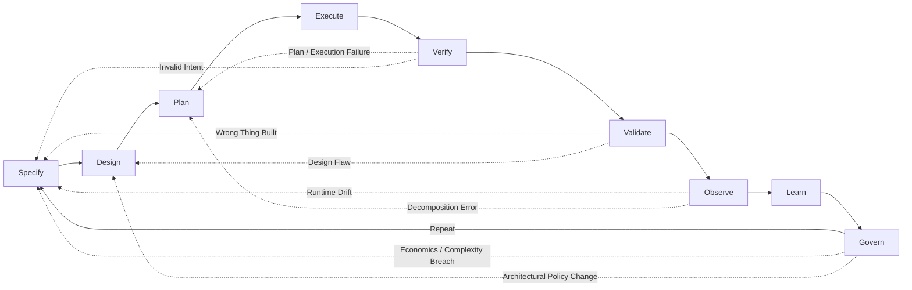

# The Agentic Engineering Manifesto

*Principles for building systems where humans steer intent, agents execute
within governed boundaries, and verified outcomes are the only measure that
matters.*

---

We are moving from writing software to architecting systems that write, test,
and ship software under human direction. Through this work, we have come to
value:

| We Value More | over | We Also Value |
|---|---|---|
| **Iterative steering and alignment** | over | Rigid upfront specifications |
| **Verified outcomes with auditable evidence** | over | Fluent assertions of success |
| **Right-sized agent collaboration** | over | Monolithic god-agents |
| **Curated, high-signal context and memory** | over | Stateless sessions and noisy memory |
| **Tooling, telemetry, and observability** | over | Chat-based heroics |
| **Resilience under stress** | over | Performance in ideal conditions |

That is, while there is value in the items on the right, we value the items on
the left more.

**Architectural basis (vendor-neutral):** enforceable constraints, durable
knowledge and memory, continuous evaluations, behavioral observability, and
economics-aware routing.

---

## What is Agentic Engineering?

Agentic Engineering is the discipline of architecting environments, constraints,
protocols, and feedback loops where autonomous agents can safely plan, execute,
and verify complex work under human governance.

It is distinct from:
- **AI Engineering**: Building and training the base models themselves.
- **Prompt Engineering**: Crafting text inputs to steer model outputs.
- **AI-Assisted Software Engineering**: Using AI as an autocomplete or co-pilot to
  write human-authored code faster.

Agentic Engineering is about treating **agents as governed system participants**
rather than as human proxies. It shifts the primary human role from writing code to
specifying intent, defining verifiable contracts, and operating the system that
executes the work. As agent capability scales, the governing challenge shifts
from aligning one model in isolation toward aligning a society of interacting
agents, tools, and humans through checks, balances, and explicit institutional
control.

---

## What This Is — and What It Is Not

This manifesto is not "prompting harder." It is not LLMs running production
unsupervised. It is not replacing engineering judgment with agent confidence,
and it is not more meetings with new names.

It is enforced constraints, verified outcomes, persistent learning, and human
accountability — applied to systems that include AI agents as first-class
participants in the engineering process.

---

## The Agentic Loop

Every principle in this manifesto serves a single feedback cycle:

**Specify → Design → Plan → Execute → Verify → Validate → Observe → Learn → Govern → Repeat**

This loop is not a waterfall. Any phase can trigger a return to an earlier one
based on evidence. The loop is the system. The principles are how you keep it honest.

- **Specify** defines what to build and why.
- **Design** architects how to build it: boundaries, topology, constraints,
  and coordination rules.
- **Plan** decomposes the design into executable steps.
- **Execute** carries out the plan within bounded autonomy.
- **Verify** checks the output against the specification (did we build it right?).
- **Validate** checks the outcome against real-world need (did we build the right thing?).
- **Observe** monitors runtime behavior, drift, and cost.
- **Learn** updates knowledge and memory from observations. At Phases 4–5,
  this means: add durable findings to the knowledge base and curate learned
  memory with new heuristics, routing preferences, and reusable skills.
  Updating model weights (fine-tuning, RLHF) is a separate infrastructure
  concern applicable at Phase 6 and beyond — not a per-loop operation for
  most organizations. Knowledge captures durable truth; memory captures
  learned heuristics and reusable skills.
- **Govern** applies policy, accountability, change control, and economics review.
  When inference or governance cost exceeds the value of the work, Govern
  signals Specify to simplify scope or reduce autonomy rather than continuing
  to spend. A Govern cycle is not complete until: all outstanding policy
  violations are resolved, accountability signals are within threshold (no
  rubber-stamping pattern detected), economics review is recorded, and any
  architectural decisions triggered by governance are filed back into Design.

Verification and validation are distinct disciplines. Verification is
technical correctness against the spec. Validation is fitness for intended use
in the real world. An agent can pass every verification check and still fail
validation. Both are required.

Failures are data across every phase. Incidents, hallucinations, and policy
violations must produce post-incident updates to specifications, evaluations,
tooling constraints, and memory before retry.

**When a feedback arrow fires, a remediation sub-cycle must complete before
re-entering the loop:**
1. **Diagnose** — classify the failure from traces: specification error,
   verification gap, enforcement failure, or operational override.
2. **Update** — patch memory, tighten contracts, or revise the specification
   to address the root cause.
3. **Gate** — add or strengthen an evaluation that would catch this failure
   class before retrying.
4. **Re-verify** — run the updated evaluation suite before advancing.

Skipping to step 4 without steps 1–3 is a retry, not remediation, and is
the primary cause of hallucination loops.

---

## The New Way of Working

**Humans** express intent as specifications with constraints and acceptance
criteria — then refine those specifications as evidence accumulates. They encode
architecture as enforceable, monitored domain boundaries. They set autonomy
tiers appropriate to risk. They own outcomes and remain accountable. They do not
supervise every intermediate step — they define what success looks like, verify
that the system achieved it, and inspect the reasoning when it matters.

**Agents** decompose specifications into executable tasks. They execute within
domain boundaries, right-sized to complexity. They verify their own outputs
against evaluations. They report evidence, not assertions. They learn from
failure and encode that learning in memory — with provenance, so the system
knows where every lesson came from.

**Systems** maintain persistent knowledge and curated learned memory. They route
work to appropriate model tiers based on cost and quality requirements. They
enforce architectural constraints at runtime and monitor for violations. They
observe behavior, surface anomalies, and maintain the feedback loops that make
everything else work. They forget what no longer serves them.

See [Roles and the Human Side](adoption-roles.md) for how each role evolves
through the phase transitions.

---

## Scope and Non-Goals

**What this manifesto covers:**
- The engineering discipline for building and operating systems that include
  autonomous agents as first-class participants in the software development and
  delivery lifecycle (SDLC).
- Governance structures, autonomy controls, and evidence practices for
  agent-assisted software engineering.
- Adoption guidance for regulated and unregulated software delivery contexts,
  including V-model and compliance-heavy organizations.
- Domain-specific mappings to regulatory frameworks for aviation, automotive,
  medical devices, pharmaceuticals, financial services, and defense/government.

**What this manifesto does not cover:**
- Training, fine-tuning, or evaluating foundation models. That is AI engineering.
- Deploying agents in physical systems, robotics, or non-software operational
  domains.
- Product management, UX design, or organizational strategy beyond what
  directly governs agent autonomy and accountability.
- Legal advice, compliance determinations, or jurisdiction-specific regulatory
  guidance. The domain pages map principles to frameworks; they are not
  substitutes for qualified regulatory counsel.
- Autonomous weapons systems, or the safety certification of autonomous control
  systems themselves (e.g., certifying an ALKS or autopilot function). The
  domain pages cover *software engineering governance for teams building those
  systems*; they do not cover the operational safety certification of the
  resulting autonomous system.

**What requires separate guidance:**
- Agentic systems operating outside the SDLC (e.g., customer-facing autonomous
  agents, trading agents, autonomous process automation at industrial scale).
  The principles are relevant starting points, but the operational context —
  real-time customer exposure, regulatory regimes, failure modes — differs
  enough to require purpose-built guidance rather than direct application.
- Federated agent networks without a single accountable operator (distinct from
  multi-provider model routing, which P11 addresses).
- Agent deployment in classified environments (the domain pages note this
  boundary; they do not provide guidance for classified system development).

## How to Read This Manifesto

Use two layers:

- **Manifesto core** (this document + Twelve Principles + Definition of Done):
  values, principles with minimum bars, and what "done" means. Start here.
- **Companion guidance** (Companion Guide and its linked documents): extended
  rationale, tradeoffs, worked patterns, failure modes, organizational change
  management, and domain-specific regulatory alignment. Come here when
  implementing. The companion layer is itself multi-document; the full map
  is in [companion-guide.md](companion-guide.md).

The two-layer framing is accurate but incomplete. The minimum bars in the
principles are necessary conditions; they are not sufficient for safe operation
at Phase 4 and above. At higher phases, certain companion content becomes
operationally essential rather than supplementary: the
[Specifications vs. Constraints](companion-principles.md#specifications-vs-constraints)
distinction (P2), [rubber-stamping detection](adoption-metrics.md#team-health-metrics-all-phases)
(P12), the [Adaptation Envelope — Layer 4](companion-re-framework.md#4-behavioral-envelopes)
(P6), and the [worked failure-mode patterns](companion-patterns.md) (P10/P12)
are required reading before operating autonomy above Tier 1. If the core
document describes the floor, these documents describe the walls and ceiling.

**On evidence.** This manifesto demands evidence as a discipline. We apply
that standard to our own claims: empirically supported claims carry citations;
threshold values are labeled as practitioner heuristics; deductive arguments
are stated as arguments so they can be evaluated independently. Some claims in
an emerging discipline necessarily precede the empirical grounding they ideally
require. Treat those claims as hypotheses and revise them as evidence
accumulates. That is what a living specification means in practice.

## Contents

### [Twelve Principles](manifesto-principles.md)

The engineering principles that operationalize the six values: outcomes,
specifications, architecture, swarm topology, autonomy tiers, knowledge and
memory, context, evaluations and proofs, observability and interoperability,
emergence and containment, economics, and accountability.

### [The Agentic Definition of Done](manifesto-done.md)

What "done" means in agentic engineering: shipped, observable, verified,
provable, learned from, governed, and economical. Phase-calibrated, not
all-or-nothing.

### [Glossary](glossary.md)

Canonical definitions for terms used across this document set: agent,
autonomy tier, blast radius, evidence bundle, evaluation, knowledge, learned
memory, specification, trace, verification, validation, and more.

---

*Exploration is a phase. Engineering is a discipline. These principles are not
the last word — they are the minimum for a world where systems build, test, and
ship their own code under human direction. The question that remains is whether
governance can scale as fast as autonomy. We bet it can. This manifesto is how
we intend to prove it.*
