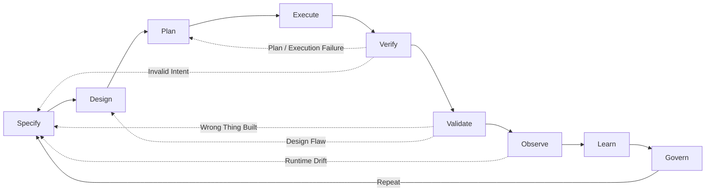

# The Agentic Engineering Manifesto

*Principles for building systems where humans steer intent, agents execute
within governed boundaries, and verified outcomes are the only measure that
matters.*

---

We are moving from writing software to architecting systems that write, test,
and ship software under human direction. Through this work, we have come to
value:

| We Value More | over | We Also Value |
|---|---|---|
| **Iterative steering and alignment** | over | Rigid upfront specifications |
| **Verified outcomes with auditable evidence** | over | Fluent assertions of success |
| **Right-sized agent collaboration** | over | Monolithic god-agents |
| **Curated, high-signal context and memory** | over | Stateless sessions and noisy memory |
| **Tooling, telemetry, and observability** | over | Chat-based heroics |
| **Resilience under stress** | over | Performance in ideal conditions |

That is, while there is value in the items on the right, we value the items on
the left more.

**Architectural basis (vendor-neutral):** enforceable constraints, durable
knowledge and memory, continuous evaluations, behavioral observability, and
economics-aware routing.

---

## What is Agentic Engineering?

Agentic Engineering is the discipline of architecting environments, constraints,
protocols, and feedback loops where autonomous agents can safely plan, execute,
and verify complex work under human governance.

It is distinct from:
- **AI Engineering**: Building and training the base models themselves.
- **Prompt Engineering**: Crafting text inputs to steer model outputs.
- **AI-Assisted Software Engineering**: Using AI as an autocomplete or co-pilot to
  write human-authored code faster.

Agentic Engineering is about treating **agents as system components** rather
than as human proxies. It shifts the primary human role from writing code to
specifying intent, defining verifiable contracts, and operating the system that
executes the work. As agent capability scales, the governing challenge shifts
from aligning one model in isolation toward aligning a society of interacting
agents, tools, and humans through checks, balances, and explicit institutional
control.

---

## What This Is — and What It Is Not

This manifesto is not "prompting harder." It is not LLMs running production
unsupervised. It is not replacing engineering judgment with agent confidence,
and it is not more meetings with new names.

It is enforced constraints, verified outcomes, persistent learning, and human
accountability — applied to systems that include AI agents as first-class
participants in the engineering process.

---

## The Agentic Loop

Every principle in this manifesto serves a single feedback cycle:

**Specify → Design → Plan → Execute → Verify → Validate → Observe → Learn → Govern → Repeat**

This loop is not a waterfall. Any phase can trigger a return to an earlier one
based on evidence. The loop is the system. The principles are how you keep it honest.

- **Specify** defines what to build and why.
- **Design** architects how to build it: boundaries, topology, constraints.
  and coordination rules.
- **Plan** decomposes the design into executable steps.
- **Execute** carries out the plan within bounded autonomy.
- **Verify** checks the output against the specification (did we build it right?).
- **Validate** checks the outcome against real-world need (did we build the right thing?).
- **Observe** monitors runtime behavior, drift, and cost.
- **Learn** updates knowledge, memory, and models from observations.
  Knowledge captures durable truth; memory captures learned heuristics and
  reusable skills.
- **Govern** applies policy, accountability, and change control.

Verification and validation are distinct disciplines. Verification is
technical correctness against the spec. Validation is fitness for intended use
in the real world. An agent can pass every verification check and still fail
validation. Both are required.

Failures are data across every phase. Incidents, hallucinations, and policy
violations must produce post-incident updates to specifications, evaluations,
tooling constraints, and memory before retry.

---

## Contents

### [Twelve Principles](manifesto-principles.md)

The engineering principles that operationalize the six values: outcomes,
specifications, architecture, swarm topology, autonomy tiers, knowledge and
memory, context, evaluations and proofs, observability and interoperability,
emergence and containment, economics, and accountability.

### [The Agentic Definition of Done](manifesto-done.md)

What "done" means in agentic engineering: shipped, observable, verified,
provable, learned from, governed, and economical. Phase-calibrated, not
all-or-nothing.

---

*Exploration is a phase. Engineering is a discipline. These principles are not
the last word — they are the minimum for a world where systems build, test, and
ship their own code under human direction. The question that remains is whether
governance can scale as fast as autonomy. We bet it can. This manifesto is how
we intend to prove it.*
