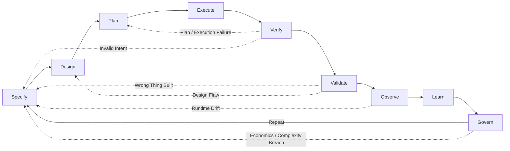

# The Agentic Engineering Manifesto

*Principles for building systems where humans steer intent, agents execute
within governed boundaries, and verified outcomes are the only measure that
matters.*

---

We are moving from writing software to architecting systems that write, test,
and ship software under human direction. Through this work, we have come to
value:

| We Value More | over | We Also Value |
|---|---|---|
| **Iterative steering and alignment** | over | Rigid upfront specifications |
| **Verified outcomes with auditable evidence** | over | Fluent assertions of success |
| **Right-sized agent collaboration** | over | Monolithic god-agents |
| **Curated, high-signal context and memory** | over | Stateless sessions and noisy memory |
| **Tooling, telemetry, and observability** | over | Chat-based heroics |
| **Resilience under stress** | over | Performance in ideal conditions |

That is, while there is value in the items on the right, we value the items on
the left more.

**Architectural basis (vendor-neutral):** enforceable constraints, durable
knowledge and memory, continuous evaluations, behavioral observability, and
economics-aware routing.

---

## What is Agentic Engineering?

Agentic Engineering is the discipline of architecting environments, constraints,
protocols, and feedback loops where autonomous agents can safely plan, execute,
and verify complex work under human governance.

It is distinct from:
- **AI Engineering**: Building and training the base models themselves.
- **Prompt Engineering**: Crafting text inputs to steer model outputs.
- **AI-Assisted Software Engineering**: Using AI as an autocomplete or co-pilot to
  write human-authored code faster.

Agentic Engineering is about treating **agents as system components** rather
than as human proxies. It shifts the primary human role from writing code to
specifying intent, defining verifiable contracts, and operating the system that
executes the work. As agent capability scales, the governing challenge shifts
from aligning one model in isolation toward aligning a society of interacting
agents, tools, and humans through checks, balances, and explicit institutional
control.

---

## What This Is — and What It Is Not

This manifesto is not "prompting harder." It is not LLMs running production
unsupervised. It is not replacing engineering judgment with agent confidence,
and it is not more meetings with new names.

It is enforced constraints, verified outcomes, persistent learning, and human
accountability — applied to systems that include AI agents as first-class
participants in the engineering process.

---

## The Agentic Loop

Every principle in this manifesto serves a single feedback cycle:

**Specify → Design → Plan → Execute → Verify → Validate → Observe → Learn → Govern → Repeat**

This loop is not a waterfall. Any phase can trigger a return to an earlier one
based on evidence. The loop is the system. The principles are how you keep it honest.

- **Specify** defines what to build and why.
- **Design** architects how to build it: boundaries, topology, constraints.
  and coordination rules.
- **Plan** decomposes the design into executable steps.
- **Execute** carries out the plan within bounded autonomy.
- **Verify** checks the output against the specification (did we build it right?).
- **Validate** checks the outcome against real-world need (did we build the right thing?).
- **Observe** monitors runtime behavior, drift, and cost.
- **Learn** updates knowledge and memory from observations. At Phases 4–5,
  this means: add durable findings to the knowledge base and curate learned
  memory with new heuristics, routing preferences, and reusable skills.
  Updating model weights (fine-tuning, RLHF) is a separate infrastructure
  concern applicable at Phase 6 and beyond — not a per-loop operation for
  most organizations. Knowledge captures durable truth; memory captures
  learned heuristics and reusable skills.
- **Govern** applies policy, accountability, change control, and economics review.
  When inference or governance cost exceeds the value of the work, Govern
  signals Specify to simplify scope or reduce autonomy rather than continuing
  to spend.

Verification and validation are distinct disciplines. Verification is
technical correctness against the spec. Validation is fitness for intended use
in the real world. An agent can pass every verification check and still fail
validation. Both are required.

Failures are data across every phase. Incidents, hallucinations, and policy
violations must produce post-incident updates to specifications, evaluations,
tooling constraints, and memory before retry.

**When a feedback arrow fires, a remediation sub-cycle must complete before
re-entering the loop:**
1. **Diagnose** — classify the failure from traces: specification error,
   verification gap, enforcement failure, or operational override.
2. **Update** — patch memory, tighten contracts, or revise the specification
   to address the root cause.
3. **Gate** — add or strengthen an evaluation that would catch this failure
   class before retrying.
4. **Re-verify** — run the updated evaluation suite before advancing.

Skipping to step 4 without steps 1–3 is a retry, not remediation, and is
the primary cause of hallucination loops.

---

## Why Engineering Rigor Creates Competitive Advantage

The organizations pulling ahead with AI are not winning because they have access to better models — the same foundation models are available to everyone. They are winning because they can apply those models faster, at greater scale, and with less risk than competitors who are still governing AI with processes designed for human developers.

That advantage is an engineering discipline problem, not a technology problem. The gap between a team that can safely expand agent autonomy and a team stuck in Phase 3 — running agents under loose supervision because the governance infrastructure is not there — is the same gap as between a team with mature CI/CD and a team still doing manual deployments. It compounds over time: faster verification enables faster shipping; faster shipping produces more learning; better learning sharpens specifications. The Agentic Loop is not a workflow — it is a compounding return on engineering investment.

The organizations that reach Phase 5 — multi-domain, evidence-driven, continuously learning — are not just more efficient. They are structurally harder to catch. Every cycle of the Agentic Loop widens the gap between them and organizations still measuring velocity in story points.

This manifesto is the engineering foundation for that compounding return. It is not a constraint on speed. It is what makes speed sustainable.

---

## The New Way of Working

**Humans** express intent as specifications with constraints and acceptance
criteria — then refine those specifications as evidence accumulates. They encode
architecture as enforceable, monitored domain boundaries. They set autonomy
tiers appropriate to risk. They own outcomes and remain accountable. They do not
supervise every intermediate step — they define what success looks like, verify
that the system achieved it, and inspect the reasoning when it matters.

**Agents** decompose specifications into executable tasks. They execute within
domain boundaries, right-sized to complexity. They verify their own outputs
against evaluations. They report evidence, not assertions. They learn from
failure and encode that learning in memory — with provenance, so the system
knows where every lesson came from.

**Systems** maintain persistent knowledge and curated learned memory. They route
work to appropriate model tiers based on cost and quality requirements. They
enforce architectural constraints at runtime and monitor for violations. They
observe behavior, surface anomalies, and maintain the feedback loops that make
everything else work. They forget what no longer serves them.

See [Roles and the Human Side](adoption-roles.md) for how each role evolves
through the phase transitions.

---

## How to Read This Manifesto

Use two layers:

- **Manifesto core** (this document + Twelve Principles + Definition of Done):
  values, principles with minimum bars, and what "done" means. Start here.
- **Companion guidance** (Companion Guide and its linked documents): extended
  rationale, tradeoffs, worked patterns, failure modes, organizational change
  management, and domain-specific regulatory alignment. Come here when
  implementing.

## Contents

### [Twelve Principles](manifesto-principles.md)

The engineering principles that operationalize the six values: outcomes,
specifications, architecture, swarm topology, autonomy tiers, knowledge and
memory, context, evaluations and proofs, observability and interoperability,
emergence and containment, economics, and accountability.

### [The Agentic Definition of Done](manifesto-done.md)

What "done" means in agentic engineering: shipped, observable, verified,
provable, learned from, governed, and economical. Phase-calibrated, not
all-or-nothing.

---

*Exploration is a phase. Engineering is a discipline. These principles are not
the last word — they are the minimum for a world where systems build, test, and
ship their own code under human direction. The question that remains is whether
governance can scale as fast as autonomy. We bet it can. This manifesto is how
we intend to prove it.*
