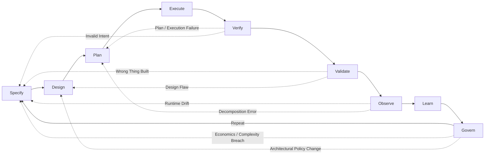

# The Agentic Engineering Manifesto

*Principles for building systems where humans steer intent, agents execute
within governed boundaries, and verified outcomes are the only measure that
matters.*

---

We are moving from writing software to architecting systems that write, test,
and ship software under human direction. Through this work, we have come to
value:

| We Value More | over | We Also Value |
| --- | --- | --- |
| **Iterative steering and alignment** | over | Rigid upfront specifications |
| **Verified outcomes with auditable evidence** | over | Fluent assertions of success |
| **Right-sized agent collaboration** | over | Monolithic god-agents |
| **Curated, high-signal context and memory** | over | Stateless sessions and noisy memory |
| **Tooling, telemetry, and observability** | over | Chat-based heroics |
| **Resilience under stress** | over | Performance in ideal conditions |

That is, while there is value in the items on the right, we value the items on
the left more.

**Architectural basis (vendor-neutral):** enforceable constraints, durable
knowledge and memory, continuous evaluations, behavioral observability, and
economics-aware routing.

---

## What is Agentic Engineering?

Agentic Engineering is the discipline of architecting environments, constraints,
protocols, and feedback loops where autonomous agents can safely plan, execute,
and verify complex work under human governance.

It is distinct from:
- **AI Engineering**: Building and training the base models themselves.
- **Prompt Engineering**: Crafting text inputs to steer model outputs.
- **AI-Assisted Software Engineering**: Using AI as an autocomplete or co-pilot to
  write human-authored code faster.

Agentic Engineering is about treating **agents as governed system participants**
rather than as human proxies. It shifts the primary human role from writing code to
specifying intent, defining verifiable contracts, and operating the system that
executes the work. As agent capability scales, the governing challenge shifts
from aligning one model in isolation toward aligning a society of interacting
agents, tools, and humans through checks, balances, and explicit institutional
control.

---

## What This Is — and What It Is Not

This manifesto is not "prompting harder." It is not LLMs running production
unsupervised. It is not replacing engineering judgment with agent confidence,
and it is not more meetings with new names.

It is enforced constraints, verified outcomes, persistent learning, and human
accountability — applied to systems that include AI agents as first-class
participants in the engineering process.

---

## The Agentic Loop

Every principle in this manifesto serves a single feedback cycle:

**Specify → Design → Plan → Execute → Verify → Validate → Observe → Learn → Govern → Repeat**

This loop is not a waterfall. Any phase can trigger a return to an earlier one
based on evidence. The loop is the system. The principles are how you keep it honest.

- **Specify** defines what to build and why.
- **Design** architects how to build it: boundaries, topology, constraints,
  and coordination rules.
- **Plan** decomposes the design into executable steps.
- **Execute** carries out the plan within bounded autonomy.
- **Verify** checks the output against the specification (did we build it right?).
- **Validate** checks the outcome against real-world need (did we build the right thing?).
- **Observe** monitors runtime behavior, drift, and cost.
- **Learn** updates knowledge and memory from observations. At Phases 4–5,
  this means: add durable findings to the knowledge base and curate learned
  memory with new heuristics, routing preferences, and reusable skills.
  Updating model weights (fine-tuning, RLHF) is a separate infrastructure
  concern applicable at Phase 6 and beyond — not a per-loop operation for
  most organizations. Knowledge captures durable truth; memory captures
  learned heuristics and reusable skills.
- **Govern** applies policy, accountability, change control, and economics review.
  When inference or governance cost exceeds the value of the work, Govern
  signals Specify to simplify scope or reduce autonomy rather than continuing
  to spend. A Govern cycle is not complete until: all outstanding policy
  violations are resolved, accountability signals are within threshold (no
  rubber-stamping pattern detected), economics review is recorded, any
  architectural decisions triggered by governance are filed back into Design,
  and tool invocations during the loop are confirmed within the authorized
  scope for the operating tier — any out-of-scope tool call is classified as
  a policy violation and triggers the remediation sub-cycle before the loop
  repeats.

### What the Loop Produces

The loop's output is not code. It is an **evidence-backed deployable** — a
package of artefacts that together satisfy the Definition of Done and provide
the release layer with everything it needs to make a governed deployment decision.

A complete loop output contains:

**The deployable artefact.** The code, configuration, model, or process change
that implements the specification. Built, tested, and ready to deploy to the
target environment.

**The evidence bundle.** Per Principle 1 and the Definition of Done: evaluation
reports with pass/fail and metrics, trace IDs linking to the full decision chain,
diffs showing what changed, policy check outputs confirming constraint compliance,
and memory updates confirming what was learned. The evidence bundle is the
machine-readable record of how "done" was proven. Anything less is assertion.

**The specification artefact.** The versioned, final state of the specification
as it stood when the evaluation suite passed. This is the document against which
independent validation (P8) is performed, and the reference against which future
changes to this component will be assessed.

**The rollback procedure.** A tested rollback plan (not just documented — tested
in a representative environment) that allows the deployment to be reversed within
a defined time window if the change produces unintended production behaviour.
The rollback procedure is a condition of the DoD's "Governed" criterion.

**The accountability sign-off.** A named human who has reviewed the evidence
bundle, accepted that the DoD conditions are satisfied, and accepts production
accountability for the outcome (P12). This is not a rubber stamp — it is the
governance record that the evidence was reviewed.

**The control state record.** A machine-readable record — generated at loop
completion, not assembled post-hoc — that states, for every required control:
whether it passed, failed, was waived, is stale, or requires a human decision
before the release gate can be cleared. This is distinct from the evidence
bundle: the evidence bundle contains the artefacts that constitute the
evidence; the control state record contains the structured verdict on each
control. A release layer that receives an evidence bundle without a control
state record cannot assess gate readiness without re-reading all artefacts. A
release layer that receives a control state record can assess gate readiness
programmatically and route only the exceptions that require human judgment. A
waived control must carry: the waiver rationale, the name of the human who
granted the waiver, and an expiry date after which the waiver lapses and the
control reverts to required.

These artefacts are handed to the release layer as a unit. A release layer that
accepts a deployable without a complete evidence bundle is accepting unverified
output. A release layer that accepts an evidence bundle without a named accountable
human is accepting ungoverned output. Both are governance failures at the boundary,
not in the loop.

Verification and validation are distinct disciplines. Verification is
technical correctness against the spec. Validation is fitness for intended use
in the real world. An agent can pass every verification check and still fail
validation. Both are required.

Failures are data across every phase. Incidents, hallucinations, and policy
violations must produce post-incident updates to specifications, evaluations,
tooling constraints, and memory before retry.

**When a feedback arrow fires, a remediation sub-cycle must complete before
re-entering the loop:**
1. **Diagnose** — classify the failure from traces: specification error,
   verification gap, enforcement failure, or operational override.
2. **Update** — patch memory, tighten contracts, or revise the specification
   to address the root cause.
3. **Gate** — add or strengthen an evaluation that would catch this failure
   class before retrying.
4. **Re-verify** — run the updated evaluation suite before advancing.

Skipping to step 4 without steps 1–3 is a retry, not remediation, and is
the primary cause of hallucination loops.

```mermaid
flowchart LR
    Specify --> Design --> Plan --> Execute --> Verify --> Validate --> Observe --> Learn --> Govern
    Govern -->|Repeat| Specify

    Verify -.->|Plan / Execution Failure| Plan
    Verify -.->|Invalid Intent| Specify
    Validate -.->|Wrong Thing Built| Specify
    Validate -.->|Design Flaw| Design
    Observe -.->|Runtime Drift| Specify
    Observe -.->|Decomposition Error| Plan
    Govern -.->|Economics / Complexity Breach| Specify
    Govern -.->|Architectural Policy Change| Design
```

### What Must Be True Before Entering Specify

The loop is rigorous. It verifies, validates, observes, learns, and governs with
discipline. But that rigour is only as valuable as the intent it is applied to.
Specify is not the beginning of a software lifecycle — it is the beginning of
the execution phase. Something must precede it.

A specification is **loop-ready** when all of the following are true:

**Business need validated.** The need is real and evidence-backed — not just
articulated. User research, data analysis, regulatory mandate, or executive
decision with documented rationale constitutes validation. A stakeholder request
without supporting evidence is not a validated need.

**Value measurable.** A success criterion at the business level exists and is
measurable post-deployment. "Improve customer experience" is not measurable.
"Reduce mean time to resolution for claims by 20% within 90 days of deployment"
is. If you cannot define what business success looks like before entering the
loop, you cannot validate at the end.

**Acceptance criteria expressible.** The need can be expressed as machine-readable
acceptance criteria and constraints. If a domain expert cannot write a first draft
of the acceptance criteria before the loop starts, the need is not well-understood
enough to specify.

**Constraints identified.** Security requirements, compliance obligations, domain
ownership boundaries, performance envelopes, and data classification constraints
are known before Specify begins. Discovering a compliance constraint at the
Verify phase is a scope failure, not a verification failure.

**Accountable human named.** A named person accepts business-level accountability
for the outcome before the loop runs — the P12 anchor, established upstream. This
person owns the success criterion, not the implementation.

**Blast radius assessed.** A preliminary assessment of maximum credible impact if
the implementation fails. This informs the autonomy tier (P5) and the scope of
the evidence bundle required. A change whose failure impacts one microservice
requires different governance than one whose failure affects a regulatory filing.

**Out-of-scope explicitly stated.** What this specification explicitly does not
include. Absent this, scope expands during execution — a common driver of
specification drift inside the loop.

If these conditions are not met, the work is not loop-ready and should not enter the loop. Resolving these gaps requires demand governance upstream of engineering execution — clarifying the need, establishing measurable success criteria, and confirming constraints before the loop runs.
Entering the loop without a loop-ready specification does not save time — it
produces well-executed work on the wrong problem.

*Minimum bar: If you cannot answer "what does business success look like and how
will you measure it?" before entering Specify, the loop is not ready to run.*

---

## The New Way of Working

**Humans** express intent as specifications with constraints and acceptance
criteria — then refine those specifications as evidence accumulates. They encode
architecture as enforceable, monitored domain boundaries. They set autonomy
tiers appropriate to risk. They own outcomes and remain accountable. They do not
supervise every intermediate step — they define what success looks like, verify
that the system achieved it, and inspect the reasoning when it matters.

**Agents** decompose specifications into executable tasks. They execute within
domain boundaries, right-sized to complexity. They verify their own outputs
against evaluations. They report evidence, not assertions. They learn from
failure and encode that learning in memory — with provenance, so the system
knows where every lesson came from.

**Systems** maintain persistent knowledge and curated learned memory. They route
work to appropriate model tiers based on cost and quality requirements. They
enforce architectural constraints at runtime and monitor for violations. They
observe behavior, surface anomalies, and maintain the feedback loops that make
everything else work. They forget what no longer serves them.

See [Roles and the Human Side](adoption-roles.md) for how each role evolves
through the phase transitions.

---

## Scope and Framework Context

### What this manifesto covers

The engineering discipline for governing systems that include autonomous agents
as first-class participants in **engineering execution**: from a loop-ready
specification entering Specify through governed output exiting the loop. This
includes:

- The Agentic Loop: Specify, Design, Plan, Execute, Verify, Validate, Observe,
  Learn, Govern — and the feedback paths between them.
- Governance structures, autonomy controls, and evidence practices for the
  execution phase.
- The Definition of Done: the conditions that prove a loop output is complete.
- Adoption guidance for transitioning teams through the maturity phases.
- Domain-specific mappings to regulatory frameworks for teams in regulated
  industries.

### Position as shared engineering execution infrastructure

This manifesto governs engineering execution — from a loop-ready specification entering Specify through governed output exiting the loop. Outer lifecycle frameworks, covering what precedes the loop (demand validation, portfolio governance) and what follows it (release governance, operations, maintenance, and product lifecycle governance), depend on this manifesto as their shared engineering execution standard. The principles apply in full regardless of delivery mode; the outer frameworks govern what the manifesto does not.

### What this manifesto does not cover

The following are explicitly out of scope for this document:

- Business need validation, demand prioritisation, portfolio governance, and specification readiness — the upstream work that determines what enters the loop.
- Release gates, environment promotion, change management, and compliance documentation for the deployment boundary — the downstream work that governs how loop output reaches production.
- Incident management, SLO governance, security patching, ownership transfer, and system deprecation — the operational work that governs systems in production.
- Agent product brief and trust model design, persona design, and regulatory risk classification — the product conception work that precedes engineering execution for agent products.
- Behavioral envelope specification at the product level, use-case coverage mapping, uncertainty protocol, and escalation design for agent products.
- Behavioral release gates, composite state versioning, behavioral drift governance, foundation model update governance, and regulated retirement for agent products.

**Out of scope in all frameworks:**
- Training, fine-tuning, or evaluating foundation models.
- Deploying agents in physical systems, robotics, or non-software operational
  domains.
- Legal advice, compliance determinations, or jurisdiction-specific regulatory
  guidance. Domain pages map principles to frameworks; they are not substitutes
  for qualified regulatory counsel.
- Autonomous weapons systems, or the safety certification of autonomous control
  systems themselves.
- Federated agent networks without a single accountable operator.
- Agent deployment in classified environments.

## How to Read This Manifesto

Use two layers:

- **Manifesto core** (this document + Twelve Principles + Definition of Done):
  values, principles with minimum bars, and what "done" means. Start here.
- **Companion guidance** (Companion Guide and its linked documents): extended
  rationale, tradeoffs, worked patterns, failure modes, organizational change
  management, and domain-specific regulatory alignment. Come here when
  implementing. The companion layer is itself multi-document; the full map
  is in [companion-guide.md](companion-guide.md).

The two-layer framing is accurate but incomplete. The minimum bars in the
principles are necessary conditions; they are not sufficient for safe operation
at Phase 4 and above. At higher phases, certain companion content becomes
operationally essential rather than supplementary: the
[Specifications vs. Constraints](companion-principles.md#specifications-vs-constraints)
distinction (P2), [rubber-stamping detection](adoption-metrics.md#team-health-metrics-all-phases)
(P12), the [Adaptation Envelope — Layer 4](companion-re-framework.md#4-the-behavioral-envelope)
(P6), and the [worked failure-mode patterns](companion-patterns.md) (P10/P12)
are required reading before operating autonomy above Tier 1. If the core
document describes the floor, these documents describe the walls and ceiling.

**On evidence.** This manifesto demands evidence as a discipline. We apply
that standard to our own claims: empirically supported claims carry citations;
threshold values are labeled as practitioner heuristics; deductive arguments
are stated as arguments so they can be evaluated independently. Some claims in
an emerging discipline necessarily precede the empirical grounding they ideally
require. Treat those claims as hypotheses and revise them as evidence
accumulates. That is what a living specification means in practice.

Concretely: numeric thresholds in this document — for example, the 80%
first-pass verification rate and three-iteration specification stability gate
(P2), the 20% cost-divergence threshold and 48-hour rollback freshness window
(Definition of Done), and the phase-to-tier ceilings (P5) — are practitioner
heuristics, not validated thresholds. They exist to make the bar concrete, not
to assert that one number rather than another has been empirically established.
Measure your baseline, calibrate against it, and revise as evidence
accumulates. Treating these numbers as authoritative without local calibration
is a misreading of the document.

## Contents

### [Twelve Principles](manifesto-principles.md)

The engineering principles that operationalize the six values: outcomes,
specifications, architecture, swarm topology, autonomy tiers, knowledge and
memory, context, evaluations and proofs, observability and interoperability,
emergence and containment, economics, and accountability.

### [The Agentic Definition of Done](manifesto-done.md)

What "done" means in agentic engineering: shipped, observable, verified,
provable, learned from, governed, and economical. Phase-calibrated, not
all-or-nothing.

### [Glossary](glossary.md)

Canonical definitions for terms used across this document set: agent,
autonomy tier, blast radius, evidence bundle, evaluation, knowledge, learned
memory, specification, trace, verification, validation, and more.

---

*Exploration is a phase. Engineering is a discipline. These principles are not
the last word — they are the minimum for a world where systems build, test, and
ship their own code under human direction. The question that remains is whether
governance can scale as fast as autonomy. We bet it can. This manifesto is how
we intend to prove it.*
